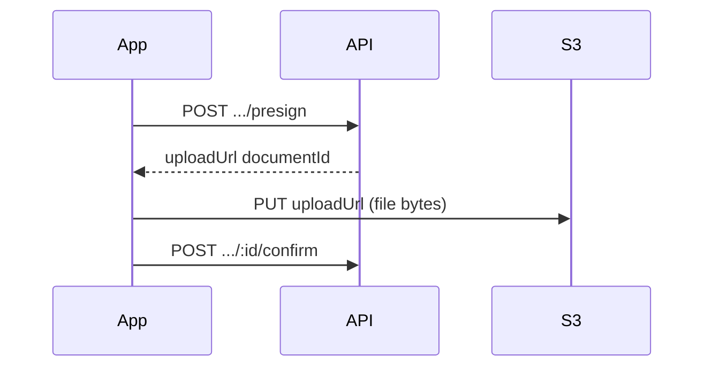
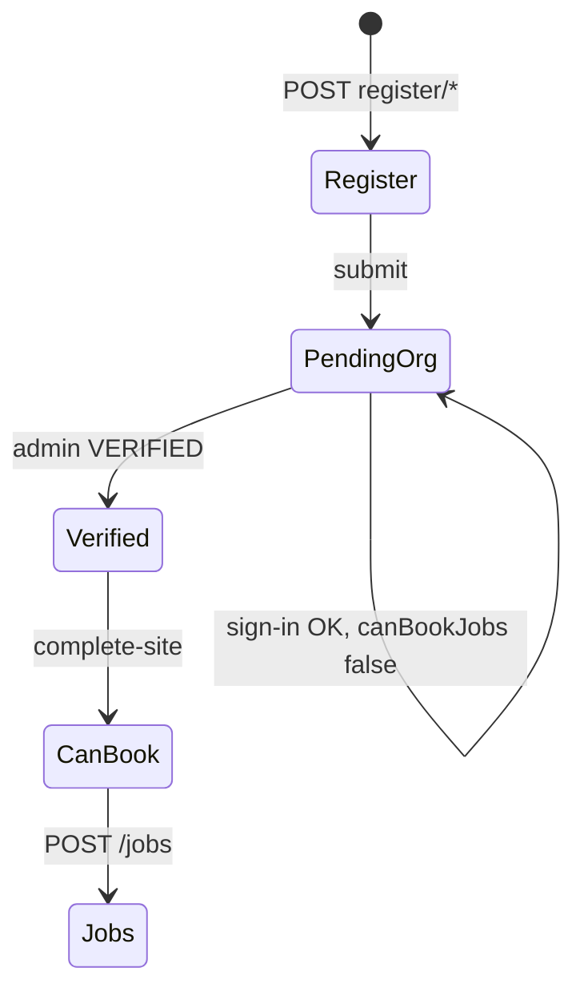

# Client & mobile integration guide

How frontend and mobile apps should call the G2 Sentry Guardian API: which routes to use, when, and what to check before calling them.

**Schemas and field types:** Swagger at `{API_URL}/docs` (source of truth).  
**Deep flows:** [onboarding.md](onboarding.md), [auth.md](auth.md), [../user-journeys.md](../user-journeys.md).

## Base URL and headers

| Item | Value |
|------|--------|
| Local API | `http://localhost:3000/api/v1` |
| Prefix | From `API_PREFIX` (default `/api/v1`) |
| Auth (protected routes) | `Authorization: Bearer <accessToken>` |
| Content type | `application/json` unless uploading to S3 |

## Which app uses what

| Surface | Audience | Primary prefixes | Do not use |
|---------|----------|------------------|------------|
| **Client app** | Organization owners & staff | `/auth`, `/users`, `/organizations`, `/jobs`, `/payments`, `/notifications`, `/regions`, `/documents` | `/admin/*`, `/webhooks/*` |
| **Guardian app** | Field guardians | `/auth`, `/users`, `/guardians`, `/assignments`, `/jobs` (read), `/notifications` | `/auth/register/*`, `/admin/*` |
| **Admin / ops portal** | `SUPER_ADMIN`, `OPS_ADMIN` | `/admin/*` (+ shared read routes as needed) | Client registration wizard |

Guardians **cannot** call `POST /auth/register/*`. They are created by ops via `/admin/guardians`.

---

## HTTP client habits

### Tokens

| Token | When | Header |
|-------|------|--------|
| **Onboarding JWT** | Registration steps before submit | `Authorization: Bearer <onboardingToken>` |
| **Access JWT** | All post-login API calls | `Authorization: Bearer <accessToken>` |
| **Refresh JWT** | Body of `POST /auth/refresh` only | Not sent as Bearer on normal routes |

Access tokens are short-lived (default **15m**). Store refresh token securely; on `401`, call `POST /auth/refresh` and retry once.

### Multi-organization clients

After sign-in, the access token includes `activeOrgId`. Job and payment calls are scoped to that org.

- List orgs: `GET /users/me` → `organizations[]`
- Switch org: `POST /auth/context` with `{ "organizationId": "<uuid>" }` → new access token
- Refresh profile flags after switch: `GET /users/me` again

### Permissions vs UI gates

`GET /users/me` returns `permissions[]` (effective for `activeRole` + `activeOrgId`). Use permission codes to show/hide features (e.g. `jobs:create`).

For **booking**, also use org-level flags (cheaper than handling `403`):

| Flag | Meaning | Typical UI |
|------|---------|------------|
| `verificationStatus` | `PENDING`, `VERIFIED`, `REJECTED`, … | Wait / complete site / contact support |
| `canBookJobs` | Org verified **and** primary site map-pinned | Enable “Book job” |
| `needsSiteSetup` | Verified but pin not set | Map screen → complete site |
| `rejectionReason` | Admin rejected org | Show reason |

### Development OTP

When `NODE_ENV !== production`, OTP responses include **`devCode`**. See [getting-started.md](../getting-started.md).

---

## Document upload (S3 presign)

Same pattern everywhere; only the presign path differs.



| Context | Presign | Confirm |
|---------|---------|---------|
| Registration | `POST /auth/register/documents/presign` | `POST /auth/register/documents/:id/confirm` |
| After login | `POST /documents/presign` | `POST /documents/:id/confirm` |
| Download metadata | — | `GET /documents/:id` |

Upload the file to `uploadUrl` with the HTTP method and headers Swagger documents for that endpoint (typically `PUT`).

---

## Client app — screen → API map

### Auth & onboarding

| Screen / goal | Endpoints | Notes |
|---------------|-----------|-------|
| New user — phone OTP | `POST /auth/register/start` → `.../start/verify` | Returns `onboardingToken` |
| Resume incomplete reg | `POST /auth/register/resume` | OTP or phone+password |
| Wizard steps | `PATCH /auth/register/profile`, `.../business`, `.../payment`, `.../location` | Bearer onboarding token |
| Upload verification docs | register presign/confirm | Rules by `orgType` — [onboarding.md](onboarding.md) |
| Check wizard progress | `GET /auth/register/status` | |
| Finish registration | `POST /auth/register/submit` | Returns access + refresh tokens |
| Sign in | `POST /auth/sign-in/password` or OTP flow | `ONBOARDING_INCOMPLETE` if submit not done |
| Session | `POST /auth/refresh`, `POST /auth/logout` | |
| Switch org | `POST /auth/context` | |

Full step table: [onboarding.md](onboarding.md).

### Post-login home & profile

| Screen / goal | Endpoints | Notes |
|---------------|-----------|-------|
| App bootstrap / home | `GET /users/me` | Roles, orgs, `canBookJobs`, `permissions` |
| Edit profile email | `PATCH /users/me` | |
| District picker (reg & jobs) | `GET /regions/districts` | Bearer JWT |

### Organization & site setup

| Screen / goal | Endpoints | Notes |
|---------------|-----------|-------|
| Org detail | `GET /organizations/:id` | |
| List locations | `GET /organizations/:id/locations` | |
| **Complete site (map pin)** | `POST /organizations/:id/locations/primary/complete-site` | Required after admin `VERIFIED`; sets `canBookJobs` |
| Add/edit locations | `POST /organizations/:id/locations`, `PATCH .../:locationId` | Permission `organizations:manage_locations` |
| Team | `GET/POST/DELETE .../members` | Invite/remove staff |
| Org invoices list | `GET /organizations/:id/invoices` | |

### Jobs (client)

| Screen / goal | Endpoints | Notes |
|---------------|-----------|-------|
| List jobs | `GET /jobs` | Query params in Swagger |
| Job detail | `GET /jobs/:id` | |
| Timeline | `GET /jobs/:id/timeline` | |
| Create job | `POST /jobs` | Requires `canBookJobs`; see errors below |
| Dispatch | `POST /jobs/:id/dispatch` | Finds eligible on-duty guardians |
| Cancel | `PATCH /jobs/:id/cancel` | |
| Mark complete (client) | `POST /jobs/:id/complete` | |
| Incidents | `GET/POST /jobs/:id/incidents` | |
| Invoice for job | `GET /jobs/:id/invoice` | Before or after payment |

### Payments

| Screen / goal | Endpoints | Notes |
|---------------|-----------|-------|
| Pay invoice | `POST /payments` | Org must be `VERIFIED` + site pinned |
| Confirm provider result | `POST /payments/:id/confirm` | After MoMo (or provider) callback flow in app |

### Notifications

| Screen / goal | Endpoints |
|---------------|-----------|
| Inbox | `GET /notifications` |
| Mark read | `PATCH /notifications/:id/read` |
| Mark all read | `POST /notifications/read-all` |

Poll or pull on app foreground; push is not described in this API surface yet.

---

## Guardian app — screen → API map

### Auth

| Screen / goal | Endpoints | Notes |
|---------------|-----------|-------|
| Sign in | `POST /auth/sign-in/password` or OTP | No self-registration |
| First password | `POST /auth/password/set` | After admin activate (setup token if applicable) |
| Session | `POST /auth/refresh`, `POST /auth/logout` | |

### Profile & duty

| Screen / goal | Endpoints | Notes |
|---------------|-----------|-------|
| Bootstrap | `GET /users/me` | `guardianId`, roles |
| Guardian profile | `GET /guardians/me`, `PATCH /guardians/me` | |
| Certifications | `GET /guardians/me/certifications` | |
| **Go on duty** | `POST /guardians/me/shift/start` | Eligibility checks (verified, certs, etc.) |
| **Go off duty** | `POST /guardians/me/shift/end` | |
| Location while on job | `POST /guardians/me/heartbeat` | Send periodically while on active assignment |

### Assignments & job execution

| Screen / goal | Endpoints | Notes |
|---------------|-----------|-------|
| Offers & active job | `GET /assignments/me` | Poll while on duty; offers expire (`DISPATCH_OFFER_TTL_MS`, default 90s) |
| Accept / decline offer | `POST /assignments/:id/accept`, `.../decline` | `:id` is assignment id |
| En route | `POST /assignments/:id/en-route` | |
| On site | `POST /assignments/:id/on-site` | |
| Complete (guardian) | `POST /assignments/:id/complete` | |
| Client no-show | `POST /assignments/:id/no-show` | Body: `reason` |
| Job detail (read) | `GET /jobs/:id` | Shared with client |

Recommended guardian loop while on duty:

1. `GET /assignments/me` every few seconds when waiting for offers.
2. After accept → `en-route` → `on-site` → `complete` as UX requires.
3. `POST /guardians/me/heartbeat` on an interval during active assignment (exact interval is a product choice; server enforces eligibility).

---

## Client lifecycle (one diagram)



Details: [../user-journeys.md](../user-journeys.md) §1 and §4.

---

## Error codes → UI (mobile-friendly)

| Code | App | Suggested UX |
|------|-----|----------------|
| `USER_NOT_REGISTERED` | Client | Prompt to register |
| `PHONE_ALREADY_REGISTERED` | Client | Go to sign-in |
| `ONBOARDING_INCOMPLETE` | Client | Resume registration wizard |
| `ONBOARDING_TOKEN_INVALID` | Client | Restart or `register/resume` |
| `INVALID_CREDENTIALS` | Both | Wrong password message |
| `ORG_PENDING_VERIFICATION` | Client | “Account under review” — hide book/pay |
| `PRIMARY_LOCATION_SETUP_REQUIRED` | Client | Navigate to map / complete site |
| `DOCUMENTS_REQUIRED` | Client | Return to document step |
| `GUARDIAN_NOT_ACTIVATED` | Guardian | Contact ops |
| `PHONE_NOT_VERIFIED` | Both | Complete OTP step |

Full auth list: [auth.md](auth.md). Registration list: [onboarding.md](onboarding.md).

API errors use a consistent JSON shape (see Swagger / actual responses); map `code` field when present.

---

## Routes to ignore in mobile apps

| Prefix | Reason |
|--------|--------|
| `/admin/*` | Ops portal only |
| `/webhooks/*` | Server-to-server (payment providers) |
| `/auth/otp/request`, `/auth/otp/verify` | Deprecated — use `/auth/sign-in/otp/*` |

---

## Local testing quick reference

| Persona | Phone | Password |
|---------|-------|----------|
| Client owner (verified, can book) | `+250788000001` | `TestPass123!` |
| Guardian (verified, on duty eligible) | `+250788000002` | `TestPass123!` |

```http
POST /api/v1/auth/sign-in/password
Content-Type: application/json

{ "phone": "+250788000001", "password": "TestPass123!" }
```

More: [getting-started.md](../getting-started.md).

---

## Related documentation

| Doc | Use for |
|-----|---------|
| [README.md](README.md) | Controller index |
| [onboarding.md](onboarding.md) | Registration + complete site |
| [auth.md](auth.md) | Sign-in, tokens, errors |
| [changelog.md](changelog.md) | Deprecated paths |
| [../architecture.md](../architecture.md) | Permissions model (backend) |
| [../user-journeys.md](../user-journeys.md) | End-to-end product flows |
