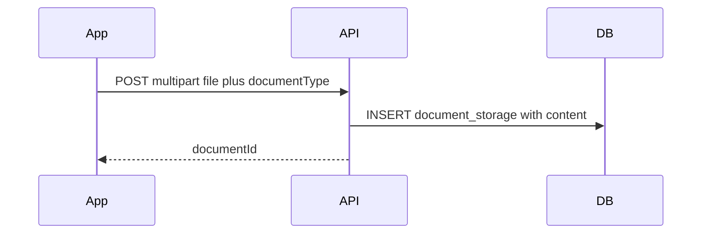
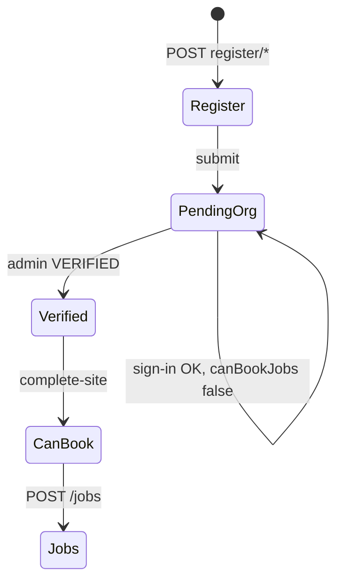

# Client & mobile integration guide

How frontend and mobile apps should call the G2 Sentry Guardian API: which routes to use, when, and what to check before calling them.

**Schemas and field types:** Swagger at `{API_URL}/docs` (source of truth).  
**Billing overhaul (confirmation, disputes, invoice JSON):** [../billing-overhaul-implementation.md](../billing-overhaul-implementation.md)  
**Deep flows:** [onboarding.md](onboarding.md), [admin-onboarding.md](admin-onboarding.md), [auth.md](auth.md), [guardians.md](guardians.md), [../user-journeys.md](../user-journeys.md).

## Base URL and headers

| Item | Value |
|------|--------|
| Local API | `http://localhost:3000/api/v1` |
| Prefix | From `API_PREFIX` (default `/api/v1`) |
| Auth (protected routes) | `Authorization: Bearer <accessToken>` |
| Content type | `application/json` unless uploading documents (`multipart/form-data`) |

## Which app uses what

| Surface | Audience | Primary prefixes | Do not use |
|---------|----------|------------------|------------|
| **Client app** | Organization owners & staff | `/auth`, `/users`, `/organizations`, `/jobs`, `/payments`, `/notifications`, `/regions`, `/documents` | `/admin/*`, `/webhooks/*` |
| **Guardian app** | Field guardians | `/auth`, `/users`, `/guardians`, `/assignments`, `/jobs` (read), `/notifications` | `/auth/register/*`, `/admin/*` |
| **Admin / ops portal** | `SUPER_ADMIN`, `OPS_ADMIN` | `/admin/*` (+ shared read routes as needed) | Client registration wizard |

Guardians **cannot** call `POST /auth/register/*`. They are created by ops via `POST /admin/guardians` — see [admin-onboarding.md](admin-onboarding.md).

---

## HTTP client habits

### Tokens

| Token | When | Header |
|-------|------|--------|
| **Onboarding JWT** | Registration steps before submit | `Authorization: Bearer <onboardingToken>` |
| **Access JWT** | All post-login API calls | `Authorization: Bearer <accessToken>` |
| **Refresh JWT** | Body of `POST /auth/refresh` only | Not sent as Bearer on normal routes |

Access tokens are short-lived (default **15m**). Store refresh token securely; on `401`, call `POST /auth/refresh` and retry once.

### Multi-organization clients

After sign-in, the access token includes `activeOrgId`. Job and payment calls are scoped to that org.

- List orgs: `GET /users/me` → `organizations[]`
- Switch org: `POST /auth/context` with `{ "organizationId": "<uuid>" }` → new access token
- Refresh profile flags after switch: `GET /users/me` again

### Permissions vs UI gates

`GET /users/me` returns `permissions[]` (effective for `activeRole` + `activeOrgId`). Use permission codes to show/hide features (e.g. `jobs:create`).

For **booking**, also use org-level flags (cheaper than handling `403`):

| Flag | Meaning | Typical UI |
|------|---------|------------|
| `verificationStatus` | `PENDING`, `VERIFIED`, `REJECTED`, … | Wait / complete site / contact support |
| `canBookJobs` | Org verified **and** primary site map-pinned | Enable “Book job” |
| `needsSiteSetup` | Verified but pin not set | Map screen → complete site |
| `rejectionReason` | Admin rejected org | Show reason |

### Development OTP

When `NODE_ENV !== production`, OTP responses include **`devCode`**. See [getting-started.md](../getting-started.md).

---

## Document upload (PostgreSQL)

One-shot multipart upload; file bytes are stored in the database.



| Context | Upload | Download |
|---------|--------|----------|
| Registration | `POST /auth/register/documents` (`file`, `documentType`) | — |
| After login | `POST /documents` (`file`) | `GET /documents/:id` (metadata), `GET /documents/:id/content` (bytes) |
| Admin review | — | `GET /admin/verification/documents/:documentId/content` (org KYC **or** guardian cert `document.id`) |

Allowed MIME types: `image/jpeg`, `image/png`, `application/pdf`. Max size: `DOCUMENT_MAX_BYTES` (default 10 MB).

---

## Client app — screen → API map

### Auth & onboarding

| Screen / goal | Endpoints | Notes |
|---------------|-----------|-------|
| New user — phone OTP | `POST /auth/register/start` → `.../start/verify` | Returns `onboardingToken` |
| Resume incomplete reg | `POST /auth/register/resume` | OTP or phone+password |
| Wizard steps | `PATCH /auth/register/profile`, `.../business`, `.../payment`, `.../location` | Bearer onboarding token |
| Upload verification docs | `POST /auth/register/documents` | Rules by `orgType` — [onboarding.md](onboarding.md) |
| Check wizard progress | `GET /auth/register/status` | |
| Finish registration | `POST /auth/register/submit` | Returns access + refresh tokens |
| Sign in | `POST /auth/sign-in/password` (`login` = phone or email) or OTP | `ONBOARDING_INCOMPLETE` if submit not done |
| Session | `POST /auth/refresh`, `POST /auth/logout` | |
| Switch org | `POST /auth/context` | |

Full step table: [onboarding.md](onboarding.md).

### Post-login home & profile

| Screen / goal | Endpoints | Notes |
|---------------|-----------|-------|
| App bootstrap / home | `GET /users/me` | Roles, orgs, `canBookJobs`, `permissions` |
| Edit profile email | `PATCH /users/me` | |
| District picker (reg & jobs) | `GET /regions/districts` | Bearer JWT |

### Organization & site setup

| Screen / goal | Endpoints | Notes |
|---------------|-----------|-------|
| Org detail | `GET /organizations/:id` | |
| List locations | `GET /organizations/:id/locations` | |
| **Complete site (map pin)** | `POST /organizations/:id/locations/primary/complete-site` | Required after admin `VERIFIED`; sets `canBookJobs` |
| Add/edit locations | `POST /organizations/:id/locations`, `PATCH .../:locationId` | Permission `organizations:manage_locations` |
| Team | `GET/POST/DELETE .../members` | Invite/remove staff |
| Org invoices list | `GET /organizations/:id/invoices` | |

### Jobs (client)

| Screen / goal | Endpoints | Notes |
|---------------|-----------|-------|
| List jobs | `GET /jobs` | Includes nested `location` and `organization`; query params in Swagger |
| Job detail | `GET /jobs/:id` | Includes `location`, `organization`, `assignments`, `statusHistory` |
| Live map / ETA | `GET /jobs/:id/tracking` | After guardian accept; poll ~10–15s — [mobile-job-dispatch-and-tracking.md](mobile-job-dispatch-and-tracking.md) §3.3 |
| Timeline | `GET /jobs/:id/timeline` | |
| Create job | `POST /jobs` | Requires `canBookJobs`; auto-queues dispatch — see [job-dispatch-frontend.md](job-dispatch-frontend.md) |
| Dispatch | `POST /jobs/:id/dispatch` | Optional retry / `DISPATCHING` status; finds eligible on-duty guardians |
| Cancel | `PATCH /jobs/:id/cancel` | |
| Mark complete (client) | `POST /jobs/:id/complete` | Required to issue invoice after guardian complete (`AWAITING_CONFIRMATION` → `COMPLETED`); idempotent if already completed |
| Incidents | `GET/POST /jobs/:id/incidents` | |
| Invoice for job | `GET /jobs/:id/invoice` | `ClientInvoiceDetail`: `scheduledWindow`, `actual`, `billing`, `amounts`, `lineItems` — [invoice-detail.md](invoice-detail.md) |
| Invoice detail | `GET /invoices/:id` | Same contract; first view moves `DRAFT` → `PENDING_CONFIRMATION` |
| Org invoices | `GET /organizations/:id/invoices` | `ClientInvoiceSummary[]` for history list |
| Dispute invoice | `POST /invoices/:id/dispute` | `billing:dispute`; blocks issue/payment until resolved |

### Payments

| Screen / goal | Endpoints | Notes |
|---------------|-----------|-------|
| Pay invoice | `POST /payments` | Org must be `VERIFIED` + site pinned |
| Confirm provider result | `POST /payments/:id/confirm` | After MoMo (or provider) callback flow in app |

### Notifications

| Screen / goal | Endpoints |
|---------------|-----------|
| Inbox | `GET /notifications` |
| Mark read | `PATCH /notifications/:id/read` |
| Mark all read | `POST /notifications/read-all` |

Poll or pull on app foreground; push is not described in this API surface yet.

Route on `payload.action` when present (see [email-notifications.md](email-notifications.md) in-app matrix): e.g. `VIEW_JOB` → job detail, `VIEW_OFFER` / `VIEW_ASSIGNMENTS` → assignments, `REVIEW_INVOICE` / `VIEW_INVOICE` → invoice, `COMPLETE_SITE_SETUP` → site pinning, `REVIEW_REPLACEMENT` → ops replacement queue.

---

## Guardian app — screen → API map

### Auth

| Screen / goal | Endpoints | Notes |
|---------------|-----------|-------|
| Sign in | `POST /auth/sign-in/password` or OTP | No self-registration |
| First password | `POST /auth/password/set` | After admin activate (setup token if applicable) |
| Session | `POST /auth/refresh`, `POST /auth/logout` | |

### Profile & duty

Duty labels (**offline**, **available**, **busy**) and `shift_status` mapping: [guardians.md](guardians.md).

| Screen / goal | Product state | Endpoints | Notes |
|---------------|---------------|-----------|-------|
| Bootstrap | — | `GET /users/me` | `guardianId`, roles |
| Guardian profile | — | `GET /guardians/me`, `PATCH /guardians/me` | `GET /guardians/me` includes `shiftState` for current duty |
| Certifications | — | `GET /guardians/me/certifications`, `GET /guardians/me/certifications/:certificationId` | Includes linked document metadata when present |
| **Available** (on duty) | `AVAILABLE` | `POST /guardians/me/shift/start` | Also set automatically on guardian sign-in when off duty |
| **Offline** (off duty) | `OFF_DUTY` | `POST /guardians/me/shift/end` | Stays offline until next sign-in or manual `shift/start` |
| **Busy** (on assignment) | `BUSY` | — | Set by server; read via `GET /guardians/me` |
| Location while on job | — | `POST /guardians/me/heartbeat` | Presence/location only; does not change duty state |

### Assignments & job execution

| Screen / goal | Endpoints | Notes |
|---------------|-----------|-------|
| Offers & active job | `GET /assignments/me` | Poll while on duty; offers expire (`DISPATCH_OFFER_TTL_MS`, default 90s) — full flow: [job-dispatch-frontend.md](job-dispatch-frontend.md) |
| Accept / decline offer | `POST /assignments/:id/accept`, `.../decline` | `:id` is assignment id |
| En route | `POST /assignments/:id/en-route` | |
| On site | `POST /assignments/:id/on-site` | |
| Complete (guardian) | `POST /assignments/:id/complete` | Authoritative completion trigger; job → `COMPLETED`, invoice issued, `billing.invoiceIssued` email to org owners |
| Client no-show | `POST /assignments/:id/no-show` | Body: `reasonCode` (required), `reasonNote` (optional). Allowed from `OFFERED`/`ACCEPTED`/`EN_ROUTE`; transitions job to `DISPATCHING` and re-queues dispatch |
| Job detail (read) | `GET /jobs/:id` | Shared with client |

### Earnings & payouts

| Screen / goal | Endpoints | Notes |
|---------------|-----------|-------|
| Earnings summary | `GET /guardians/me/earnings` | `pendingPayout`, `paidTotal`, etc.; optional `from`/`to` |
| Earnings ledger | `GET /guardians/me/earnings/ledger` | Per-job lines after client pays invoice |
| Payout history | `GET /guardians/me/payouts` | Ops disbursements (MoMo/bank) |

Earnings accrue when the client payment is confirmed — not on assignment complete. See [guardians.md](guardians.md) § Earnings lifecycle.

Recommended guardian loop while on duty:

1. `GET /assignments/me` every few seconds when waiting for offers.
2. After accept → `en-route` → `on-site` → `complete` as UX requires.
3. If unable to continue on site → `POST /assignments/:id/replacement-request` (ops reviews; see [replacement.md](replacement.md)).
4. `POST /guardians/me/heartbeat` on an interval during active assignment (exact interval is a product choice; server enforces eligibility).

### Status synchronization contract

Job and assignment statuses are related but not identical. The backend now enforces these synchronization rules:

| Assignment transition | Job transition |
|-----------------------|----------------|
| `OFFERED -> ACCEPTED` | `PENDING`/`DISPATCHING` -> `ASSIGNED` |
| `EN_ROUTE -> ON_SITE` | `ASSIGNED` -> `IN_PROGRESS` |
| `ON_SITE -> COMPLETED` | `ASSIGNED`/`IN_PROGRESS` -> `AWAITING_CONFIRMATION` (via billing flow) |
| `ON_SITE -> REPLACEMENT_REQUESTED` | (no job change; pending ops) |
| `REPLACEMENT_REQUESTED -> AWAITING_RELIEF` + ops approve | `IN_PROGRESS` -> `SEEKING_REPLACEMENT` + replacement dispatch |
| `REPLACEMENT_REQUESTED -> ON_SITE` + ops deny | (no job change) |
| Substitute `OFFERED -> ACCEPTED` (replacement) | (no job change; job stays `SEEKING_REPLACEMENT`) |
| Substitute `EN_ROUTE -> ON_SITE` (handoff) | `SEEKING_REPLACEMENT` -> `IN_PROGRESS`; original `AWAITING_RELIEF` -> `COMPLETED` |
| `AWAITING_RELIEF -> CANCELLED` | Job cancelled |
| `OFFERED`/`ACCEPTED`/`EN_ROUTE` -> `NO_SHOW` | `ASSIGNED`/`IN_PROGRESS`/`DISPATCHING` -> `DISPATCHING` + `JOB_DISPATCH_REQUESTED` |

### Automatic no-show policy

The backend also applies system no-show transitions:

- `ACCEPTED` assignments auto-transition to `NO_SHOW` after 20 minutes without `EN_ROUTE`.
- `EN_ROUTE` assignments auto-transition to `NO_SHOW` after `scheduledStart + 15 minutes` without `ON_SITE`.
- Automated transitions store trigger metadata as `SYSTEM`; manual endpoint transitions store `MANUAL`.

Clients should treat `assignment` as the operational driver and `job` as the aggregate lifecycle status.

### Analytics contract (client + guardian)

Use the following event and KPI contract so mobile, backend, and ops dashboards report the same numbers.

#### Canonical lifecycle events

| Event name | Trigger source | Primary IDs | Notes |
|------------|----------------|-------------|-------|
| `job_created` | `POST /jobs` success | `jobId`, `organizationId` | Start of dispatch funnel denominator |
| `job_dispatch_requested` | Auto-dispatch enqueue on create **or** `POST /jobs/:id/dispatch` | `jobId` | Keep `trigger = AUTO \| MANUAL` as an attribute |
| `assignment_offered` | Assignment enters `OFFERED` | `assignmentId`, `jobId`, `guardianId` | Offer-level denominator metrics |
| `assignment_accepted` | `POST /assignments/:id/accept` | `assignmentId`, `jobId`, `guardianId` | Job can transition to `ASSIGNED` |
| `assignment_en_route` | `POST /assignments/:id/en-route` | `assignmentId`, `jobId` | Journey timing milestone |
| `assignment_on_site` | `POST /assignments/:id/on-site` | `assignmentId`, `jobId` | Arrival timing milestone |
| `assignment_early_release_requested` | `POST /assignments/:id/early-release` | `assignmentId`, `jobId` | Guardian requests early end |
| `assignment_early_release_approved` | `POST /assignments/:id/early-release/approve` | `assignmentId`, `jobId` | Client approved early end |
| `assignment_replacement_requested` | `POST /assignments/:id/replacement-request` | `assignmentId`, `jobId` | Guardian requests replacement (ops queue) |
| `assignment_replacement_approved` | `POST /admin/assignments/:id/replacement/approve` | `assignmentId`, `jobId` | Ops approved; job → `SEEKING_REPLACEMENT` |
| `assignment_replacement_denied` | `POST /admin/assignments/:id/replacement/deny` | `assignmentId`, `jobId` | Ops denied; assignment returns `ON_SITE` |
| `assignment_replacement_handoff_completed` | Substitute `POST /assignments/:id/on-site` (handoff) | `assignmentId`, `jobId`, `guardianId` | Original relieved; client notified |
| `assignment_completed` | `POST /assignments/:id/complete` | `assignmentId`, `jobId` | Completion milestone; job → `AWAITING_CONFIRMATION` |
| `assignment_no_show` | `POST /assignments/:id/no-show` or automation policy | `assignmentId`, `jobId`, `guardianId` | Include `trigger = MANUAL \| SYSTEM` |
| `offer_expired` | Offer TTL elapsed (`EXPIRED`) | `assignmentId`, `jobId`, `guardianId` | Needed for offer conversion |
| `job_terminal` | Job reaches `COMPLETED`, `FAILED`, or `CANCELLED` | `jobId`, `organizationId` | End of funnel |

#### Required analytics attributes

Include these attributes on every event when available:

- `occurredAt` (UTC ISO timestamp), `jobId`, `assignmentId`, `organizationId`, `guardianId`
- `district`, `jobType`, `priority`, `jobStatus`, `assignmentStatus`
- `trigger` (`AUTO`, `MANUAL`, `SYSTEM`) for dispatch/no-show events
- `sourceApp` (`client`, `guardian`, `admin`, `system`)

#### KPI definitions (source of truth)

| KPI | Formula | Interpretation |
|-----|---------|----------------|
| `dispatch_conversion_rate` | `jobs_with_accepted_offer / jobs_created` | Share of created jobs that reached accepted assignment |
| `offer_acceptance_rate` | `accepted_offers / total_offers` | Guardian offer acceptance efficiency |
| `offer_expiry_rate` | `expired_offers / total_offers` | Missed-offer pressure indicator |
| `no_show_rate` | `no_show_assignments / accepted_assignments` | Operational reliability after acceptance |
| `dispatch_failure_rate` | `jobs_failed / jobs_created` | Jobs ending without successful assignment |
| `p50_time_to_first_offer` / `p95_time_to_first_offer` | `assignment_offered.occurredAt - job_created.occurredAt` | Dispatch responsiveness |
| `p50_time_to_accept` / `p95_time_to_accept` | `assignment_accepted.occurredAt - assignment_offered.occurredAt` | Guardian response speed |
| `p50_time_to_on_site` / `p95_time_to_on_site` | `assignment_on_site.occurredAt - assignment_accepted.occurredAt` | Travel/on-route performance |
| `p50_time_to_complete` / `p95_time_to_complete` | `assignment_completed.occurredAt - assignment_accepted.occurredAt` | End-to-end execution duration |

#### Slicing and dashboard rules

- Required slices: `district`, `organizationId`, `jobType`, `priority`, weekday/hour bucket, guardian cohort.
- Show funnel and latency KPIs in an ops view refreshed every 1-5 minutes.
- For weekly trend views, aggregate by day/week and include both count and rate for each KPI.
- Guardrail: suppress or flag slices with very low sample sizes (for example, `< 20` events) to avoid noisy comparisons.

#### Data quality rules

- Normalize all analytics timestamps to UTC; convert to local timezone only in UI.
- Deduplicate lifecycle events by stable IDs and transition uniqueness (`assignmentId + status + occurredAt` windowing).
- Keep no-show analytics split by trigger (`MANUAL` vs `SYSTEM`) to distinguish user-reported incidents from automation policy.
- When computing job-level metrics, treat `assignment` transitions as operational truth and `job` transitions as aggregate lifecycle state.

---

## Admin / ops portal — screen → API map

For guardian onboarding and verification. Requires `SUPER_ADMIN` or `OPS_ADMIN` JWT. Field reference: [admin-onboarding.md](admin-onboarding.md).

| Screen / action | API | Notes |
|-----------------|-----|-------|
| Sign in | `POST /auth/sign-in/password` with `login` = work email or phone | User must have admin role in DB |
| Session | `GET /users/me` | Confirm `roles` includes `OPS_ADMIN` or `SUPER_ADMIN` |
| Guardian list | `GET /admin/guardians` | Query filters: `status`, `verificationStatus` |
| **Ops map — guardians (live)** | `GET /admin/map/guardians` | Poll ~15s; filters: `connectedOnly`, `onDutyOnly`, `withLocationOnly` |
| **Ops map — client sites** | `GET /admin/map/sites` | Static org pins; filter `coordinatePrecision=USER_PINNED` for map-accurate sites |
| Create guardian | `POST /admin/guardians` | Phone, name, national ID, `districtBase`, optional vetting inline |
| Guardian detail | `GET /admin/guardians/:id` | Certs, vetting, user phone |
| Edit profile | `PATCH /admin/guardians/:id` | Partial update |
| Record RNP vetting | `POST /admin/guardians/:id/vetting` | Upsert |
| List guardian certs | `GET /admin/guardians/:id/certifications` | Document metadata when linked |
| Certification detail | `GET /admin/certifications/:id` | |
| Add certification | `POST /admin/guardians/:id/certifications` | Starts `PENDING` |
| Pending guardians queue | `GET /admin/verification/guardians` | |
| Pending certs queue | `GET /admin/verification/certifications` | Query `verificationStatus` (default `PENDING`), `page`, `limit` |
| Approve / reject guardian | `PATCH /admin/verification/guardians/:id` | `{ "status": "VERIFIED" }` before activate |
| Approve / reject cert | `PATCH /admin/verification/certifications/:id` | Need ≥1 verified non-expired cert for duty |
| Activate account | `POST /admin/guardians/:id/activate` | OTP to guardian; `devCode` in dev response |
| Suspend | `POST /admin/guardians/:id/suspend` | |
| Pending orgs (client KYC) | `GET /admin/verification/organizations` | Separate from guardian flow |
| Approve / reject org | `PATCH /admin/verification/organizations/:id` | Reject requires `reason` |

Recommended ops sequence after create: vetting → certification → verify cert → verify guardian → activate.

---

## Client lifecycle (one diagram)



Details: [../user-journeys.md](../user-journeys.md) §1 and §4.

---

## Error codes → UI (mobile-friendly)

| Code | App | Suggested UX |
|------|-----|----------------|
| `USER_NOT_REGISTERED` | Client | Prompt to register |
| `PHONE_ALREADY_REGISTERED` | Client | Go to sign-in |
| `ONBOARDING_INCOMPLETE` | Client | Resume registration wizard |
| `ONBOARDING_TOKEN_INVALID` | Client | Restart or `register/resume` |
| `INVALID_CREDENTIALS` | Both | Wrong password message |
| `ORG_PENDING_VERIFICATION` | Client | “Account under review” — hide book/pay |
| `PRIMARY_LOCATION_SETUP_REQUIRED` | Client | Navigate to map / complete site |
| `DOCUMENTS_REQUIRED` | Client | Return to document step |
| `GUARDIAN_NOT_ACTIVATED` | Guardian | Contact ops |
| `PHONE_NOT_VERIFIED` | Both | Complete OTP step |

Full auth list: [auth.md](auth.md). Client registration: [onboarding.md](onboarding.md). Guardian onboarding: [admin-onboarding.md](admin-onboarding.md).

API errors use a consistent JSON shape (see Swagger / actual responses); map `code` field when present.

---

## Routes to ignore in mobile apps

| Prefix | Reason |
|--------|--------|
| `/admin/*` | Ops portal only |
| `/webhooks/*` | Server-to-server (payment providers) |
| `/auth/otp/request`, `/auth/otp/verify` | **410 Gone** — use `/auth/sign-in/otp/*` |
| Forgot password | `POST /auth/password/reset/request` → `.../confirm` |

---

## Local testing quick reference

| Persona | Phone | Password |
|---------|-------|----------|
| Client owner (verified, can book) | `+250788000001` | `TestPass123!` |
| Guardian (verified, on duty eligible) | `+250788000002` | `TestPass123!` |

```http
POST /api/v1/auth/sign-in/password
Content-Type: application/json

{ "login": "+250788000001", "password": "TestPass123!" }
```

More: [getting-started.md](../getting-started.md).

---

## Related documentation

| Doc | Use for |
|-----|---------|
| [README.md](README.md) | Controller index |
| [jobs.md](jobs.md) | Jobs API reference (statuses, tracking contract) |
| [mobile-job-dispatch-and-tracking.md](mobile-job-dispatch-and-tracking.md) | **Mobile handoff:** dispatch, accept, live map/ETA |
| [job-dispatch-frontend.md](job-dispatch-frontend.md) | Job booking, dispatch, guardian offers (polling & status mapping) |
| [onboarding.md](onboarding.md) | Client registration + complete site |
| [admin-onboarding.md](admin-onboarding.md) | Admin guardian create/activate |
| [auth.md](auth.md) | Sign-in, tokens, errors |
| [changelog.md](changelog.md) | Deprecated paths |
| [../architecture.md](../architecture.md) | Permissions model (backend) |
| [../user-journeys.md](../user-journeys.md) | End-to-end product flows |
