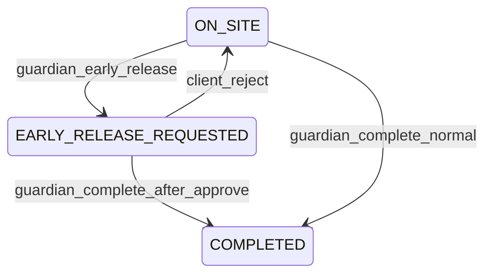

# Early release workflow

Guardians on site may request to end a shift before `scheduledEnd`. Clients (or auto-approve policy) must approve before the guardian completes and billing runs.

**Related:** [jobs.md](jobs.md), [admin-billing-policies.md](admin-billing-policies.md), [mobile-job-dispatch-and-tracking.md](mobile-job-dispatch-and-tracking.md).

---

## Policy gates (job snapshot at create)

From the resolved billing policy:

| Field | Effect |
|-------|--------|
| `allowEarlyRelease` | If false, `POST .../early-release` returns 400 |
| `earlyReleaseRequiresClientApproval` | If false, request is auto-approved immediately |
| `autoApproveAfterMinutes` | If set and client approval required, auto-approves after N minutes |
| `prorationEnabled` | If true and early release approved, `BOOKED_BLOCK` jobs bill actual on-site time |

Configure via [admin billing policies](admin-billing-policies.md).

---

## Assignment flow



| Step | Actor | Endpoint |
|------|-------|----------|
| Request | Guardian | `POST /assignments/:id/early-release` |
| Approve | Client owner/staff | `POST /assignments/:id/early-release/approve` |
| Reject | Client owner/staff | `POST /assignments/:id/early-release/reject` |
| Complete | Guardian | `POST /assignments/:id/complete` |

Permissions: `assignments:early_release` (guardian); `assignments:early_release_approve` / `assignments:early_release_reject` (client owner + ops).

---

## Request body

`POST /assignments/:id/early-release`

```json
{
  "reason": "Site closed early; client instructed guard to leave"
}
```

Reject body (optional note):

```json
{
  "note": "Coverage required until 22:00 per contract"
}
```

---

## Notifications

| Event | Template | Recipients |
|-------|----------|------------|
| Request (client approval required) | `assignment.earlyReleaseRequested` | Org owners |

---

## Billing after approved early release

- `MINIMUM_GUARANTEED` / `ACTUAL_TIME`: unchanged formulas (already cap at actual).
- `BOOKED_BLOCK` + `prorationEnabled`: invoice uses actual on-site hours (not full booked window).
- Invoice `lineItems` includes an `early_release` row when applicable.

---

## Auto-approve worker

Background scan every 60s approves requests where:

- `status = EARLY_RELEASE_REQUESTED`
- `earlyReleaseResolution` is null
- `earlyReleaseAutoApproveAt <= now`

Run `npm run db:seed` after deploy for new client permissions.
