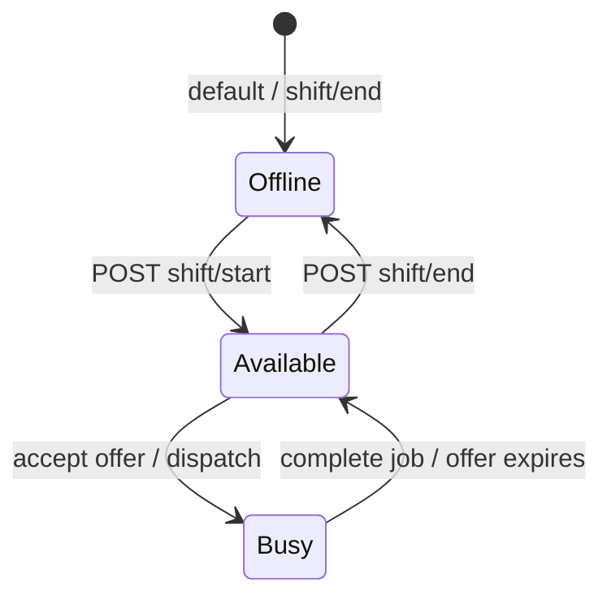

# Guardian duty & availability

How product labels (**offline**, **available**, **busy**) map to API routes, database fields, and dispatch rules.

**Schemas:** Swagger at `{API_URL}/docs` (`ShiftStatus`, `GuardianShiftState`).  
**Guardian app screen map:** [client-integration.md](client-integration.md#profile--duty).  
**Job offers & dispatch:** [job-dispatch-frontend.md](job-dispatch-frontend.md). **Mobile (heartbeat + client map):** [mobile-job-dispatch-and-tracking.md](mobile-job-dispatch-and-tracking.md).  
**Onboarding & eligibility:** [admin-onboarding.md](admin-onboarding.md#dispatch-and-shift-eligibility).

---

## Product ↔ API ↔ database

| Product / UI label | Guardian action | API | `shift_status` | `available_for_jobs` |
|--------------------|-----------------|-----|----------------|----------------------|
| **Offline** (off duty) | Go offline | `POST /guardians/me/shift/end` | `OFF_DUTY` | `false` |
| **Available** (on duty, taking jobs) | Go on duty (optional — also automatic on sign-in) | `POST /guardians/me/shift/start` | `AVAILABLE` | `true` |
| **Busy** (on an assignment) | *(none — server sets)* | — | `BUSY` | `false` |

After a job completes or an offer expires, the server returns the guardian to **available** (`AVAILABLE` + `available_for_jobs: true`) when they were already on duty.

**Read current state:** `GET /guardians/me` → `shiftState` (`shiftStatus`, `availableForJobs`, `shiftStartedAt`, `shiftEndsAt`).

There is **no** single `PATCH /guardians/me/status` endpoint; use `shift/start` and `shift/end` as above.

### Initial and admin-forced states

| Situation | `shift_status` | `available_for_jobs` | Notes |
|-----------|----------------|----------------------|-------|
| New guardian (`POST /admin/guardians`) | `OFF_DUTY` | `false` | |
| Guardian sign-in (password or OTP) | `AVAILABLE` | `true` | Auto when previously `OFF_DUTY` and dispatch-eligible |
| Guardian `POST /guardians/me/shift/end` (manual offline) | `OFF_DUTY` | `false` | Stays offline until next sign-in or `shift/start` |
| Admin suspend (`POST /admin/guardians/:id/suspend`) | `OFF_DUTY` | `false` | |
| Admin activate | `OFF_DUTY` until sign-in or `shift/start` | `false` | |

---

## `ShiftStatus` enum (database)

| Value | Meaning | Set by |
|-------|---------|--------|
| `OFF_DUTY` | Offline — not in the dispatch pool | Guardian (`shift/end`), admin suspend, initial create |
| `AVAILABLE` | On duty and eligible for new offers | Guardian sign-in (auto), `shift/start`, server after job/offer cleanup |
| `BUSY` | On duty but on an active offer/job | Server (dispatch, assignments) |
| `PAUSED` | Reserved in schema; **not used** by the API today | — |
| `SUSPENDED` | Account-level suspension context | Admin flows |

Do not send `BUSY` from the client; it is derived from assignment state.

---

## Connectivity vs duty (heartbeat)

| Concept | Mechanism | Affects dispatch? |
|---------|-----------|-------------------|
| **Duty / availability** | `guardian_shift_state` row | Yes — dispatch queries `shift_status = AVAILABLE` and `available_for_jobs = true` |
| **Reachable / location** | `POST /guardians/me/heartbeat` → presence (~90s TTL; Redis or in-memory) + `location_history` in PostgreSQL | Used for location history and connectivity checks; **does not** change `shift_status` |

A guardian can be **on duty** (`AVAILABLE`) but temporarily **unreachable** if heartbeats stop; that does not automatically call `shift/end`.

---

## Dispatch eligibility

A guardian is included in dispatch only when **all** of the following hold:

| Rule | Check |
|------|--------|
| Account active | `guardians.status = ACTIVE` |
| Identity verified | `guardians.verification_status = VERIFIED` |
| **Available (on duty)** | `shift_status = AVAILABLE` **and** `available_for_jobs = true` |
| District | Job district in `district_base` or `coverage_districts` |
| Certification | ≥1 cert `VERIFIED` and not past `expiry_date` |

`POST /guardians/me/shift/start` runs the same profile/cert checks before setting **available**.

---

## Recommended guardian app flow

1. After sign-in, show state from `GET /guardians/me` (`shiftState`).
2. **Go on duty** → `POST /guardians/me/shift/start` (handle eligibility errors).
3. While **available**, poll `GET /assignments/me` for offers.
4. During an active assignment, send `POST /guardians/me/heartbeat` on an interval (location).
5. **Go offline** → `POST /guardians/me/shift/end` (avoid if an active assignment is in progress — enforce in UI; server behavior may vary).

---

## Location read API

Heartbeats **write** coordinates; these routes **read** the latest point or history (no Redis required — presence falls back to in-memory when `REDIS_ENABLED=false`).

| Route | Permission | Description |
|-------|------------|-------------|
| `GET /guardians/me/jobs` | `jobs:read` | Paginated job history (all statuses); each item includes `location`, `organization`, your `assignments[]` (with `incidents`), and `statusHistory` |
| `GET /guardians/me/earnings` | `guardians:read_earnings` | Summary totals: `pendingPayout`, `paidTotal`, `blockedTotal`, `cancelledTotal` (optional `from`/`to` ISO query) |
| `GET /guardians/me/earnings/ledger` | `guardians:read_earnings` | Paginated per-job earnings lines (hours, rate, amount, status) — no client invoice amounts |
| `GET /guardians/me/payouts` | `guardians:read_earnings` | Paginated payout history (MoMo/bank disbursements) |
| `GET /guardians/me/location` | `guardians:read_self` | Latest fix for signed-in guardian |
| `GET /guardians/me/location/history` | `guardians:read_self` | Paginated trail (`page`, `limit`, optional `since` ISO timestamp) |
| `GET /guardians/:id/location` | `guardians:read` | Latest fix (ops / dispatch) |
| `GET /guardians/:id/location/history` | `guardians:read` | Paginated trail |
| `GET /admin/guardians/:id/location` | `admin:guardians:read` | Same as above for admin consoles |
| `GET /admin/guardians/:id/location/history` | `admin:guardians:read` | Paginated trail |

**Response (`GET …/location`):** `guardianId`, `latitude`, `longitude`, `speed`, `batteryLevel`, `recordedAt`, `source` (`presence` \| `history` \| `null`), `connected` (recent heartbeat), `reachable` (on duty per presence).

Prefer polling `GET …/location` during an active job; send heartbeats with `latitude` and `longitude` every 15–30s.

---

## Permissions

| Permission | Routes |
|------------|--------|
| `guardians:shift` | `POST /guardians/me/shift/start`, `POST /guardians/me/shift/end` |
| `guardians:heartbeat` | `POST /guardians/me/heartbeat` |
| `guardians:read_self` | `GET /guardians/me`, `GET /guardians/me/location`, `GET /guardians/me/location/history` |
| `guardians:read_earnings` | `GET /guardians/me/earnings`, `GET /guardians/me/earnings/ledger`, `GET /guardians/me/payouts` |
| `guardians:read` | `GET /guardians/:id/location`, `GET /guardians/:id/location/history` |

## Earnings lifecycle

Earnings accrue when the **client invoice is paid** (`POST /payments/:id/confirm`). Amount = assignment payable hours × guardian `hourlyPayRate` (set by ops via `PATCH /admin/guardians/:id`). Status `BLOCKED` if no rate was configured at accrual time. Ops disburses via `POST /admin/guardians/:id/payouts` then `POST /admin/guardian-payouts/:id/confirm`.

---

## Related docs

| Doc | Contents |
|-----|----------|
| [client-integration.md](client-integration.md) | Guardian app screen → endpoint table |
| [admin-onboarding.md](admin-onboarding.md) | Create, verify, activate, suspend |
| [user-journeys.md](../user-journeys.md) | End-to-end guardian and job flows |
| [changelog.md](changelog.md) | Legacy route names (`/guardians/:id/shift/*` → `/guardians/me/shift/*`) |
