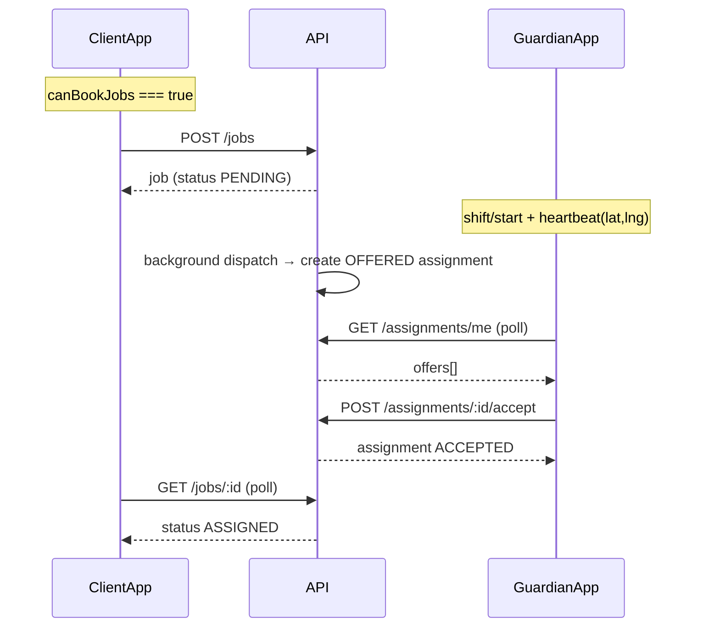

# Job booking & dispatch — frontend integration guide

**Audience:** Client app, guardian app, shared components  
**API base:** `/api/v1` (see Swagger for exact paths)  
**Mobile handoff (single doc for iOS/Android):** [mobile-job-dispatch-and-tracking.md](mobile-job-dispatch-and-tracking.md)  
**Backend route reference:** [jobs.md](jobs.md)  
**Related:** [client-integration.md](client-integration.md), [guardians.md](guardians.md), [user-journeys.md](../user-journeys.md) §4

---

## 1. Executive summary

Job booking is **asynchronous**. Creating a job does **not** immediately assign a guardian.

| App | Primary endpoints | Do **not** use for offers |
|-----|-------------------|---------------------------|
| **Client** | `POST /jobs`, poll `GET /jobs/:id` or list | — |
| **Guardian** | `GET /assignments/me`, `POST /assignments/:id/accept` | `GET /jobs` as a job board |

Guardians only receive work through **assignment offers** (`job_assignments` with status `OFFERED`). Until dispatch creates that row, the guardian job list is empty.

---

## 2. Prerequisites (client app)

Before showing “Book job”:

1. **`GET /users/me`** → `canBookJobs === true`
   - Requires org **verified** and primary site **pinned** (`POST /organizations/:id/locations/primary/complete-site`).
2. User has permission `jobs:create`.

If `canBookJobs` is false:

| Flag / error | UX |
|--------------|-----|
| Org not verified | “Account under review” — `ORG_PENDING_VERIFICATION` on `POST /jobs` |
| Site not pinned | Navigate to map — `PRIMARY_LOCATION_SETUP_REQUIRED` |

---

## 3. Job status model (server)

Backend enum (`job.jobs.status`):

| Status | Meaning |
|--------|---------|
| `PENDING` | Job created; dispatch may be queued or retrying |
| `DISPATCHING` | Dispatch explicitly started (`POST /jobs/:id/dispatch`) |
| `ASSIGNED` | Guardian accepted an offer |
| `IN_PROGRESS` | Active execution (if surfaced in your flows) |
| `COMPLETED` | Job finished |
| `FAILED` | Dispatch exhausted (after offers / attempts — see §8) |
| `CANCELLED` | Cancelled |

### Recommended client UI mapping

**Do not invent extra server statuses** like `REQUESTING`. Map UI from server state + assignment data:

| UI label (suggested) | Server signals |
|----------------------|----------------|
| **Scheduled / pending** | `status === 'PENDING'` and no accepted assignment |
| **Finding guardian** | `PENDING` or `DISPATCHING`, no assignment with `ACCEPTED` |
| **Guardian assigned** | `status === 'ASSIGNED'` (or assignment `ACCEPTED` / `EN_ROUTE` / `ON_SITE`) |
| **In progress** | Assignment `ON_SITE` or job `IN_PROGRESS` |
| **Completed** | `COMPLETED` |
| **Could not assign** | `FAILED` |
| **Cancelled** | `CANCELLED` |

**Important:** After `POST /jobs`, the job often stays **`PENDING`** until a guardian accepts. It may **never** become `DISPATCHING` unless the client calls `POST /jobs/:id/dispatch`. Auto-dispatch on create runs in the background without changing status to `DISPATCHING`.

### 3.1 Analytics status mapping contract

Use these mappings when computing analytics KPIs in admin or BI dashboards:

| Analytics event | Status evidence |
|-----------------|-----------------|
| `job_created` | `POST /jobs` success (`job.status = PENDING`) |
| `assignment_offered` | Assignment row with `status = OFFERED` |
| `assignment_accepted` | `POST /assignments/:id/accept`; assignment `OFFERED -> ACCEPTED`; job `PENDING/DISPATCHING -> ASSIGNED` |
| `assignment_on_site` | `POST /assignments/:id/on-site`; assignment reaches `ON_SITE`; job may move toward `IN_PROGRESS` |
| `assignment_completed` | `POST /assignments/:id/complete`; assignment `ON_SITE -> COMPLETED`; job `ASSIGNED/IN_PROGRESS -> COMPLETED` |
| `assignment_no_show` | Assignment `OFFERED/ACCEPTED/EN_ROUTE -> NO_SHOW`; job `ASSIGNED/IN_PROGRESS/DISPATCHING -> DISPATCHING` with re-dispatch request |
| `offer_expired` | Assignment offer transitions to `EXPIRED` after TTL |
| `job_failed` | Job reaches `FAILED` after dispatch attempt exhaustion |

For no-show analytics, always retain trigger metadata (`MANUAL` from endpoint vs `SYSTEM` from automation) so policy no-shows are reported separately from user-driven no-shows.

---

## 4. Client app flow

### 4.1 Create job

```http
POST /jobs
Authorization: Bearer <access_token>
Content-Type: application/json

{
  "organizationId": "<uuid>",
  "locationId": "<uuid>",
  "jobType": "STATIC_GUARD",
  "priority": "STANDARD",
  "scheduledStart": "2026-05-29T14:00:00.000Z",
  "scheduledEnd": "2026-05-29T22:00:00.000Z",
  "requestedGuardianCount": 1,
  "notes": "...",
  "specialInstructions": "..."
}
```

**Response:** Job object with `id`, `referenceNumber`, `status: "PENDING"`, etc.

**Side effects (server):**

- Outbox event `JOB_DISPATCH_REQUESTED` is enqueued automatically (`autoDispatch` default).
- Job status is **`PENDING`**, not `DISPATCHING`.

### 4.2 Optional: explicit dispatch

```http
POST /jobs/:id/dispatch
```

- Requires `jobs:dispatch` (client staff and owner have this in seed permissions).
- Sets status **`PENDING` → `DISPATCHING`** and queues another dispatch pass.
- **Not strictly required** if you rely on auto-dispatch after create, but useful if you want `DISPATCHING` in the UI or to retry after a stall.

### 4.3 Poll until assigned

After create, poll job detail (or list filtered by id):

```http
GET /jobs/:id
```

Include in UI:

- `status`
- `assignments[]` (on detail) — look for `status: "ACCEPTED"` or guardian info

**Polling guidance:**

| Phase | Interval | Stop when |
|-------|----------|-----------|
| Waiting for guardian | 3–5 s | `status === 'ASSIGNED'` or terminal (`FAILED`, `CANCELLED`) |
| After assigned (map / ETA) | **10–15 s** | `GET /jobs/:id/tracking` until job completed/cancelled |
| Job detail only | 10–30 s | `GET /jobs/:id` if not showing live map |

### 4.3.1 Live map and ETA (after accept)

Once a guardian has accepted (`assignment` status `ACCEPTED`, `EN_ROUTE`, or `ON_SITE`):

```http
GET /jobs/:id/tracking
```

Requires `jobs:read` (client staff/owner). Returns job-scoped data only — not a global guardian directory.

**Example response:**

```json
{
  "jobId": "uuid",
  "jobStatus": "ASSIGNED",
  "assignment": {
    "id": "uuid",
    "status": "EN_ROUTE",
    "acceptedAt": "2026-06-01T10:00:00.000Z",
    "arrivedAt": null
  },
  "guardian": {
    "id": "uuid",
    "displayName": "Jean Guard"
  },
  "location": {
    "guardianId": "uuid",
    "latitude": "-1.94",
    "longitude": "30.06",
    "speed": "8",
    "batteryLevel": 90,
    "recordedAt": "2026-06-01T10:05:00.000Z",
    "source": "presence",
    "connected": true,
    "reachable": true
  },
  "destination": {
    "locationId": "uuid",
    "name": "Site A",
    "address": "Main St",
    "latitude": "-1.95",
    "longitude": "30.06"
  },
  "distanceMeters": 1200,
  "etaMinutes": 3
}
```

| Field | Notes |
|-------|--------|
| `location` | Live Redis presence when guardian heartbeats; falls back to last `location_history` point |
| `distanceMeters` | Straight-line (haversine) to job site; `null` if coordinates missing |
| `etaMinutes` | Rough estimate from distance + guardian `speed` (m/s), or ~30 km/h default; not turn-by-turn routing |

**Errors:**

| HTTP | When |
|------|------|
| `400` | No active assignment yet (still finding guardian) |
| `403` / `404` | No access or unknown job |

Guardian must keep sending **`POST /guardians/me/heartbeat`** with lat/lng during the job for `source: "presence"` and fresh `recordedAt`.

Also available:

```http
GET /jobs/:id/timeline
```

Shows `job_status_history` for a richer activity feed.

### 4.4 List jobs

```http
GET /jobs?page=1&limit=20&status=PENDING
```

Query: `status`, `page`, `limit`, `organizationId` (ops). Returns paginated `items` + `meta`.

### 4.5 Cancel / complete

| Action | Endpoint |
|--------|----------|
| Cancel | `PATCH /jobs/:id/cancel` — body `{ "reason": "..." }` (owner/admin) |
| Complete | `POST /jobs/:id/complete` |

---

## 5. Guardian app flow

### 5.1 Bootstrap

```http
GET /users/me          → guardianId, roles, permissions
GET /guardians/me      → shiftState (OFF_DUTY | AVAILABLE | BUSY)
```

### 5.2 Go on duty (required)

```http
POST /guardians/me/shift/start
```

Fails if guardian not active/verified or no valid certification (`GUARDIAN_NOT_ACTIVE`, `GUARDIAN_NOT_VERIFIED`, `CERTIFICATION_REQUIRED`).

Expected shift state after success:

- `shiftStatus: "AVAILABLE"`
- `availableForJobs: true`

### 5.3 Heartbeat (required for dispatch)

```http
POST /guardians/me/heartbeat
Content-Type: application/json

{
  "latitude": -1.95,
  "longitude": 30.06,
  "speed": 0,
  "battery": 85
}
```

**Critical for frontend:**

- **`latitude` and `longitude` are required** for the guardian to be eligible for offers. Without them, dispatch skips the guardian.
- Send every **30–60 s** while on duty and waiting for jobs (server presence TTL ≈ **90 s**).
- Heartbeat does **not** start/end shift; only `shift/start` and `shift/end` do.

### 5.4 Receive and accept offers

```http
GET /assignments/me
```

**Response shape:**

```json
{
  "offers": [],
  "activeAssignment": null
}
```

Each offer includes nested `job`, `location`, `organization`. Use offer **`id`** (assignment id) for accept/decline.

```http
POST /assignments/:id/accept
POST /assignments/:id/decline
```

**Polling while on duty:**

| When | Endpoint | Interval |
|------|----------|----------|
| Waiting for work | `GET /assignments/me` | **3–5 s** |
| Active job | Same + heartbeat | Heartbeat 30–60 s |

**Offer TTL:** default **90 s** (`DISPATCH_OFFER_TTL_MS`). Slow polling = missed offers.

### 5.5 Do **not** use `GET /jobs` as the offer inbox

For guardians, `GET /jobs` only returns jobs where they **already have** an assignment. Before the first offer, the list is **empty**.

| Screen | Correct endpoint |
|--------|------------------|
| Incoming offers | `GET /assignments/me` → `offers` |
| Current job | `GET /assignments/me` → `activeAssignment` |
| Job detail after accept | `GET /jobs/:id` |

### 5.6 After accept

Typical sequence (permissions on each route):

1. `POST /assignments/:id/accept`
2. `POST /assignments/:id/en-route`
3. `POST /assignments/:id/on-site`
4. `POST /assignments/:id/complete`

Continue **heartbeat** during the assignment.

---

## 6. End-to-end sequence (both apps)



---

## 7. Dispatch eligibility (why offers never appear)

Dispatch selects guardians only when **all** are true:

| Rule | Guardian must |
|------|----------------|
| On duty | `POST /guardians/me/shift/start` succeeded |
| Available | `shiftStatus === AVAILABLE`, `availableForJobs === true` |
| Account | `ACTIVE`, `verification_status === VERIFIED` |
| Certification | ≥1 cert verified and not expired |
| District | Job `location.district` equals `district_base` **or** is in `coverage_districts` |
| Reachable | Heartbeat with lat/lng within ~90 s; presence `available === true` |

**Frontend checklist when testing:**

- [ ] Guardian on duty
- [ ] Heartbeat sending coordinates
- [ ] Job location district matches guardian districts (exact string)
- [ ] Guardian polling `assignments/me`, not `jobs`
- [ ] Client polling `jobs/:id` for `ASSIGNED`

---

## 8. Failure and edge cases

### Job stuck in `PENDING` (“finding guardian” forever)

- Dispatch search is bounded by **`DISPATCH_WINDOW_MS`** (default **10 minutes** from job create / first dispatch). After the deadline, the job moves to **`FAILED`** with reason `dispatch_timeout`.
- No eligible guardian → server retries in the background until the window expires.
- Client can call `POST /jobs/:id/dispatch` to force `DISPATCHING` and another pass (deadline is set on first dispatch if missing).
- Show a timeout UX (“Still looking…”) and treat `FAILED` as “could not assign”.

### `FAILED` status

Read `dispatchFailureReason` on the job (or the latest `FAILED` row in `GET /jobs/:id/timeline`):

| `dispatchFailureReason` | Meaning |
|-------------------------|---------|
| `dispatch_timeout` | No guardian accepted within `DISPATCH_WINDOW_MS` |
| `dispatch_pool_exhausted` | Every eligible guardian in the district was offered and declined/expired |
| `dispatch_unreachable_pool` | Eligible guardians existed but none were reachable (heartbeat) for `DISPATCH_UNREACHABLE_GRACE_MS` |
| `dispatch_max_offers_exceeded` | Safety cap `MAX_OFFERS_PER_JOB` reached |

Ops debugging: `GET /admin/jobs/:id/dispatch-debug` (requires `admin:analytics:read`).

### Expired offers

- Offers disappear from `GET /assignments/me` when `expiresAt` passed.
- Guardian should stay on duty + heartbeat; client keeps polling job status.

### Permissions

| Permission | Role (typical) |
|------------|----------------|
| `jobs:create` | Client staff/owner |
| `jobs:dispatch` | Client staff/owner |
| `jobs:read` | Client, guardian (limited list), ops |
| `assignments:read` | Guardian |
| `assignments:accept` / `decline` | Guardian |
| `guardians:shift` | Guardian |
| `guardians:heartbeat` | Guardian |

---

## 9. TypeScript-friendly constants

```ts
// Job status (from API)
type JobStatus =
  | 'PENDING'
  | 'DISPATCHING'
  | 'ASSIGNED'
  | 'IN_PROGRESS'
  | 'COMPLETED'
  | 'FAILED'
  | 'CANCELLED';

// Assignment status (offers + active job)
type AssignmentStatus =
  | 'OFFERED'
  | 'ACCEPTED'
  | 'DECLINED'
  | 'EXPIRED'
  | 'EN_ROUTE'
  | 'ON_SITE'
  | 'COMPLETED'
  | 'NO_SHOW'
  | 'CANCELLED';

// Suggested client UI phase
function clientJobPhase(
  job: { status: JobStatus },
  assignments?: { status: AssignmentStatus }[],
) {
  const accepted = assignments?.some((a) =>
    ['ACCEPTED', 'EN_ROUTE', 'ON_SITE'].includes(a.status),
  );
  if (job.status === 'CANCELLED') return 'cancelled';
  if (job.status === 'COMPLETED') return 'completed';
  if (job.status === 'FAILED') return 'dispatch_failed';
  if (accepted || job.status === 'ASSIGNED') return 'guardian_assigned';
  if (job.status === 'DISPATCHING' || job.status === 'PENDING')
    return 'finding_guardian';
  return 'unknown';
}
```

---

## 10. Local dev test accounts

From project docs:

| Persona | Login | Password |
|---------|-------|----------|
| Client (can book when seeded) | `+250788000001` | `TestPass123!` |
| Guardian | `+250788000002` | `TestPass123!` |

**Minimal happy path:**

1. Client: sign in → confirm `canBookJobs` → `POST /jobs`.
2. Guardian: sign in → `shift/start` → heartbeat with coordinates → poll `assignments/me`.
3. Guardian: `accept` → client poll shows `ASSIGNED`.

Ensure job **location district** matches guardian **district** in seed data.

---

## 11. Common frontend mistakes

| Mistake | Fix |
|---------|-----|
| Guardian uses `GET /jobs` for open work | Use `GET /assignments/me` |
| No heartbeat or heartbeat without GPS | Send lat/lng every 30–60 s on duty |
| UI expects `DISPATCHING` right after create | Use `PENDING` + “finding guardian” copy, or call `POST .../dispatch` |
| Custom status `REQUESTING` not in API | Derive from `PENDING` / `DISPATCHING` + assignments |
| Poll client job once | Poll every 3–5 s until `ASSIGNED` or terminal |
| Poll guardian offers slowly | Poll every 3–5 s; offers last ~90 s |

---

## 12. Endpoints quick reference

### Client

| Action | Method | Path |
|--------|--------|------|
| Create job | POST | `/jobs` |
| Dispatch (optional) | POST | `/jobs/:id/dispatch` |
| Job detail | GET | `/jobs/:id` |
| Live tracking | GET | `/jobs/:id/tracking` |
| Job list | GET | `/jobs` |
| Timeline | GET | `/jobs/:id/timeline` |
| Cancel | PATCH | `/jobs/:id/cancel` |
| Complete | POST | `/jobs/:id/complete` |

### Guardian

| Action | Method | Path |
|--------|--------|------|
| Shift on | POST | `/guardians/me/shift/start` |
| Shift off | POST | `/guardians/me/shift/end` |
| Heartbeat | POST | `/guardians/me/heartbeat` |
| Offers & active job | GET | `/assignments/me` |
| Accept / decline | POST | `/assignments/:id/accept` \| `.../decline` |
| Job detail (post-accept) | GET | `/jobs/:id` |
