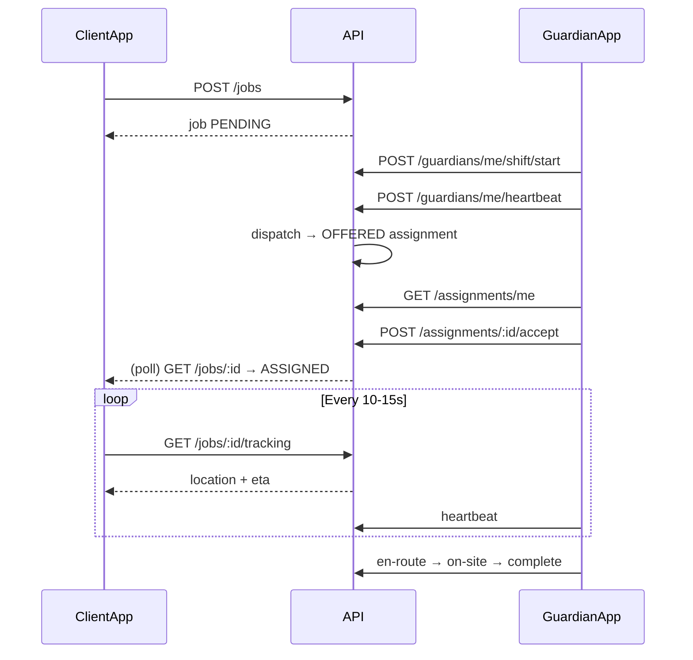

# Mobile integration — job dispatch & live tracking

**Audience:** iOS / Android developers  
**API base:** `{BASE_URL}/api/v1` (see `API_PREFIX` in `.env`; default `/api/v1`)  
**Auth:** `Authorization: Bearer <access_token>` on all endpoints below  
**Swagger:** `{BASE_URL}/docs` — request/response schemas and enums

**Related docs:** [jobs.md](jobs.md) (backend jobs + tracking API), [job-dispatch-frontend.md](job-dispatch-frontend.md) (detailed dispatch rules), [client-integration.md](client-integration.md) (full screen → API map), [guardians.md](guardians.md) (duty & heartbeat)

---

## 1. Two apps, two models

| | **Client app** (business) | **Guardian app** (field officer) |
|---|---------------------------|----------------------------------|
| **Work inbox** | N/A — you book jobs | `GET /assignments/me` → `offers[]` |
| **Job list** | `GET /jobs` | `GET /guardians/me/jobs` (history, full detail) — not for open offers |
| **Assignment** | Passive — poll until accepted | Active — accept / decline offers |
| **Live map** | `GET /jobs/:id/tracking` (after accept) | Send GPS via `POST /guardians/me/heartbeat` |

**Critical:** `POST /jobs` does **not** assign a guardian immediately. Guardians must **not** use `GET /jobs` to find open work.

---

## 2. Authentication & session

- Access token TTL ~**15 minutes**; on `401`, call `POST /auth/refresh` once and retry.
- Bootstrap: `GET /users/me` → `canBookJobs`, `activeOrgId`, roles, permissions.
- Client booking requires `canBookJobs === true` (org `VERIFIED` + primary site map-pinned).

See [auth.md](auth.md) for sign-in paths and error codes.

---

## 3. Client app — flows

### 3.1 Book a job

```http
POST /jobs
Content-Type: application/json

{
  "organizationId": "<uuid>",
  "locationId": "<uuid>",
  "jobType": "STATIC_GUARD",
  "priority": "STANDARD",
  "scheduledStart": "2026-06-01T14:00:00.000Z",
  "scheduledEnd": "2026-06-01T22:00:00.000Z",
  "requestedGuardianCount": 1,
  "notes": "...",
  "specialInstructions": "..."
}
```

**Response:** `id`, `referenceNumber`, `status: "PENDING"`, etc.

Status often stays **`PENDING`** after create (background dispatch). It may never become `DISPATCHING` unless you call `POST /jobs/:id/dispatch`.

Optional explicit dispatch / retry:

```http
POST /jobs/{jobId}/dispatch
```

### 3.2 Wait for guardian (poll job detail)

```http
GET /jobs/{jobId}
```

**Permission:** `jobs:read`

**Important:** `GET /jobs` (list) does **not** include `assignments[]`. Use **detail** for assignment state.

| Poll interval | Stop when |
|---------------|-----------|
| **3–5 s** | `status === "ASSIGNED"` OR `FAILED` OR `CANCELLED` |

**UI phase helper:**

```typescript
type JobStatus =
  | 'PENDING' | 'DISPATCHING' | 'ASSIGNED' | 'IN_PROGRESS'
  | 'SEEKING_REPLACEMENT' | 'AWAITING_CONFIRMATION'
  | 'COMPLETED' | 'FAILED' | 'CANCELLED';

type AssignmentStatus =
  | 'OFFERED' | 'ACCEPTED' | 'DECLINED' | 'EXPIRED'
  | 'EN_ROUTE' | 'ON_SITE' | 'EARLY_RELEASE_REQUESTED'
  | 'REPLACEMENT_REQUESTED' | 'COMPLETED' | 'NO_SHOW' | 'CANCELLED';

function clientPhase(
  job: { status: JobStatus },
  assignments?: { status: AssignmentStatus }[],
) {
  const active = assignments?.some((a) =>
    ['ACCEPTED', 'EN_ROUTE', 'ON_SITE', 'REPLACEMENT_REQUESTED'].includes(a.status),
  );
  if (job.status === 'CANCELLED') return 'cancelled';
  if (job.status === 'COMPLETED') return 'completed';
  if (job.status === 'AWAITING_CONFIRMATION') return 'awaiting_billing_confirmation';
  if (job.status === 'FAILED') return 'dispatch_failed';
  if (job.status === 'SEEKING_REPLACEMENT' || active || job.status === 'ASSIGNED' || job.status === 'IN_PROGRESS') {
    return 'guardian_assigned';
  }
  if (job.status === 'PENDING' || job.status === 'DISPATCHING') {
    return 'finding_guardian';
  }
  return 'unknown';
}
```

**Pitfall:** `GET /jobs?status=PENDING` — after accept the job becomes `ASSIGNED` and leaves that list. Keep polling **detail** by `jobId` from the create response.

### 3.3 Live map & ETA

```http
GET /jobs/{jobId}/tracking
```

**Permission:** `jobs:read` (client staff/owner; no extra permission)

**When:** Assignment status is `ACCEPTED`, `EN_ROUTE`, or `ON_SITE` (including during `SEEKING_REPLACEMENT` while the original officer still covers).

| Poll interval | Stop when |
|---------------|-----------|
| **10–15 s** | `jobStatus` is `COMPLETED` or `CANCELLED`, or user leaves screen |

**Before accept:** returns **400** — keep polling `GET /jobs/:id` instead.

#### Success response (200)

```json
{
  "jobId": "uuid",
  "jobStatus": "ASSIGNED",
  "assignment": {
    "id": "uuid",
    "status": "EN_ROUTE",
    "acceptedAt": "2026-06-01T10:00:00.000Z",
    "arrivedAt": null
  },
  "guardian": {
    "id": "uuid",
    "displayName": "Jean Guard"
  },
  "location": {
    "guardianId": "uuid",
    "latitude": "-1.94",
    "longitude": "30.06",
    "speed": "8",
    "batteryLevel": 90,
    "recordedAt": "2026-06-01T10:05:00.000Z",
    "source": "presence",
    "connected": true,
    "reachable": true
  },
  "destination": {
    "locationId": "uuid",
    "name": "Site A",
    "address": "Main St",
    "latitude": "-1.95",
    "longitude": "30.06"
  },
  "distanceMeters": 1200,
  "etaMinutes": 3
}
```

| Field | Mobile usage |
|-------|----------------|
| `location.latitude` / `longitude` | Parse to double; guardian map marker |
| `location.source` | `"presence"` = live (~90s); `"history"` = stale fallback |
| `location.connected` | `true` when Redis presence exists |
| `location.recordedAt` | “Last updated …” label |
| `destination` | Fixed site pin from booking |
| `distanceMeters` | Straight-line distance; `null` if coords missing |
| `etaMinutes` | **Approximate** ETA; not turn-by-turn routing |
| `assignment.status` | UI copy: on the way / on site |

**Map:** Pin site = `destination`; pin guardian = `location` when lat/lng present. If `source === "history"` or `!connected`, warn that location may be outdated.

**ETA:** Server uses haversine + guardian `speed` (m/s) or ~30 km/h default. Optional: use Maps SDK for your own routing.

#### Errors

| HTTP | When | Client UX |
|------|------|-----------|
| **400** | No active assignment | “Finding guardian…” — poll `GET /jobs/:id` |
| **403** | No org access | Re-auth / org context |
| **404** | Unknown job | Invalid id |

Clients **cannot** use `GET /guardians/:id/location` (requires ops `guardians:read`). Use **job-scoped** tracking only.

### 3.4 Client screen checklist

| Screen | Endpoints | Polling |
|--------|-----------|---------|
| Book job | `POST /jobs` | — |
| Finding guardian | `GET /jobs/:id` | 3–5 s |
| Map / ETA | `GET /jobs/:id/tracking` | 10–15 s |
| Activity | `GET /jobs/:id/timeline` | on open |
| Cancel | `PATCH /jobs/:id/cancel` | — |
| Complete | `POST /jobs/:id/complete` | — |

**No push** on guardian accept — poll until `ASSIGNED`.

---

## 4. Guardian app — flows

### 4.1 On duty & heartbeat

```http
POST /guardians/me/shift/start
```

```http
POST /guardians/me/heartbeat
Content-Type: application/json

{
  "latitude": -1.95,
  "longitude": 30.06,
  "speed": 0,
  "battery": 85
}
```

| Rule | Detail |
|------|--------|
| Interval | **30–60 s** on duty and during active job |
| GPS | **latitude + longitude required** for dispatch offers |
| Presence TTL | ~**90 s** on server |

```http
POST /guardians/me/shift/end
```

### 4.2 Offers & job execution

```http
GET /assignments/me
```

```json
{
  "offers": [],
  "activeAssignment": null
}
```

| Waiting for offers | Poll **3–5 s** |
|--------------------|----------------|
| Offer TTL | **90 s** (`expiresAt`) |

```http
POST /assignments/{assignmentId}/accept
POST /assignments/{assignmentId}/decline
POST /assignments/{assignmentId}/en-route
POST /assignments/{assignmentId}/on-site
POST /assignments/{assignmentId}/complete
POST /assignments/{assignmentId}/replacement-request
```

**Replacement:** while `ON_SITE`, guardian may request replacement (`replacement-request` + reason). Ops approves via admin API; substitute receives a normal offer. Original stays on site until substitute marks `on-site` (handoff). See [replacement.md](replacement.md).

Keep **heartbeat** during the whole assignment so the **client map** stays fresh.

**Do not** use `GET /jobs` as an offer inbox.

### 4.2.1 Job history (completed, cancelled, past shifts)

```http
GET /guardians/me/jobs?page=1&limit=20
GET /guardians/me/jobs?status=COMPLETED
```

**Permission:** `jobs:read`

Returns every job where you have at least one assignment record (any assignment status). Each item matches job **detail** shape for your side: site `location`, client `organization`, your `assignments[]` (including `incidents`), and recent `statusHistory`.

Use for **history / activity** screens. Active work and offers still come from `GET /assignments/me`.

### 4.3 Guardian screen checklist

| Screen | Endpoints |
|--------|-----------|
| Sign in | `POST /auth/sign-in/password` or OTP |
| Profile / duty | `GET /guardians/me` |
| On duty | `POST /guardians/me/shift/start` |
| Job history | `GET /guardians/me/jobs` |
| Offers | `GET /assignments/me` (poll 3–5 s) |
| Accept / decline | `POST /assignments/:id/accept` \| `decline` |
| Job steps | `en-route` → `on-site` → `complete` |
| Request replacement | `POST /assignments/:id/replacement-request` (on site only) |
| Background GPS | `POST /guardians/me/heartbeat` |

---

## 5. End-to-end sequence



---

## 6. Permissions (seed)

| Permission | Client | Guardian |
|------------|--------|----------|
| `jobs:read` | ✓ | ✓ (limited) |
| `jobs:create` | ✓ | — |
| `GET /jobs/:id/tracking` | ✓ (via `jobs:read`) | ✓ if assigned |
| `assignments:read` / `accept` / `decline` | — | ✓ |
| `guardians:shift` / `heartbeat` | — | ✓ |
| `guardians:read` (global location) | — | ops only |

Source: [`prisma/seed/permissions.ts`](../../prisma/seed/permissions.ts).

---

## 7. Local dev test accounts

After `npm run db:seed:v1`:

| Persona | Phone | Password |
|---------|-------|----------|
| Client owner | `+250788000001` | `TestPass123!` |
| Guardian | `+250788000002` | `TestPass123!` |

**Happy path:**

1. Client: `POST /jobs` → save `job.id`.
2. Guardian: `shift/start` → heartbeat with lat/lng → `GET /assignments/me` → `accept`.
3. Client: poll `GET /jobs/{id}` until `ASSIGNED` → poll `GET /jobs/{id}/tracking` every 10–15 s.

Job **location.district** must match guardian **district** in seed data.

---

## 8. Common mistakes

| Mistake | Fix |
|---------|-----|
| Client keeps cached `POST /jobs` body | Poll `GET /jobs/:id` |
| Client calls tracking before accept | Wait for `ASSIGNED`; handle 400 |
| Client only uses `GET /jobs?status=PENDING` | Poll detail by id |
| Guardian uses `GET /jobs` for offers | `GET /assignments/me` |
| No guardian heartbeat / GPS | Client sees stale `history` location |
| Slow offer polling (>30 s) | Poll 3–5 s; offers expire in 90 s |
| Expect push on accept | Poll until `ASSIGNED` |
| Treat `etaMinutes` as exact drive time | Show as approximate |

---

## 9. Endpoint quick reference

| App | Method | Path |
|-----|--------|------|
| Client | `POST` | `/jobs` |
| Client | `GET` | `/jobs/:id` |
| Client | `GET` | `/jobs/:id/tracking` |
| Client | `POST` | `/jobs/:id/dispatch` |
| Client | `GET` | `/jobs/:id/timeline` |
| Guardian | `GET` | `/guardians/me/jobs` |
| Guardian | `GET` | `/assignments/me` |
| Guardian | `POST` | `/assignments/:id/accept` |
| Guardian | `POST` | `/guardians/me/shift/start` |
| Guardian | `POST` | `/guardians/me/heartbeat` |

Implementation: [`src/jobs/jobs.service.ts`](../../src/jobs/jobs.service.ts) (`getTracking`), [`src/common/geo.util.ts`](../../src/common/geo.util.ts) (distance/ETA).
