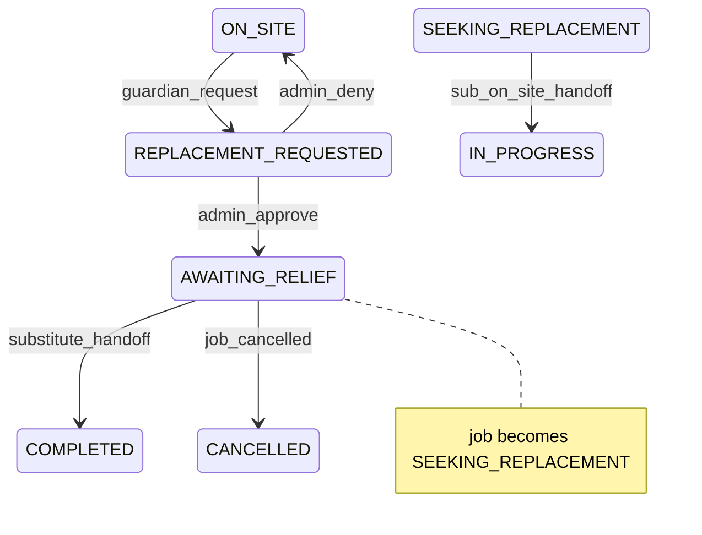

# Replacement handoff workflow

On-site guardians may request a **replacement officer** when they cannot continue coverage. Ops admin approves or denies. On approve, dispatch searches for a qualified substitute while the original officer **remains on site** in `AWAITING_RELIEF` (Option A). When the substitute marks on site, the system relieves the original officer and notifies the client.

**Related:** [jobs.md](jobs.md), [early-release.md](early-release.md), [guardians.md](guardians.md).

---

## Flow



| Step | Actor | Endpoint |
|------|-------|----------|
| Request | Guardian (`ON_SITE` only) | `POST /assignments/:id/replacement-request` |
| List pending | Ops admin | `GET /admin/assignments/replacement-requests` |
| Approve | Ops admin | `POST /admin/assignments/:id/replacement/approve` |
| Deny | Ops admin | `POST /admin/assignments/:id/replacement/deny` |
| Resume dispatch (after pause) | Ops admin | `POST /admin/jobs/:id/replacement/resume-dispatch` |
| Accept / en-route / on-site | Substitute | Standard assignment endpoints |
| Complete job | Substitute (post-handoff) | `POST /assignments/:id/complete` |

Permissions: `assignments:replacement_request` (guardian); `admin:assignments:replacement` (ops).

---

## Assignment statuses (original guardian)

| Status | Meaning |
|--------|---------|
| `ON_SITE` | Normal on-site coverage |
| `REPLACEMENT_REQUESTED` | Awaiting ops approve/deny |
| `AWAITING_RELIEF` | Ops approved; must stay on site until substitute arrives |
| `COMPLETED` | Relieved at handoff |

While `AWAITING_RELIEF`, the guardian cannot complete the assignment or request early release.

---

## Request body

`POST /assignments/:id/replacement-request`

```json
{
  "reason": "Feeling unwell; unable to continue shift safely"
}
```

Deny body (optional note):

```json
{
  "note": "Try to hold coverage for 30 more minutes; backup en route"
}
```

---

## Handoff (Option A)

1. After admin approval, original officer is `AWAITING_RELIEF` (not `ON_SITE`).
2. Substitute offer includes `replacesAssignmentId` linking to the departing assignment.
3. Substitute `POST .../on-site` triggers handoff:
   - Original assignment → `COMPLETED` (relieved at handoff time)
   - Substitute → `ON_SITE`
   - Job → `IN_PROGRESS`
4. Client owners receive email (`assignment.replacementCompleted`) and in-app notification **after handoff**, not when the request is filed.

**Substitute dispatch note:** `OFFERED → ACCEPTED` does **not** move the job to `ASSIGNED` during replacement; job stays `SEEKING_REPLACEMENT` until handoff. Use the substitute assignment status for UI.

---

## Job status

| Status | Meaning |
|--------|---------|
| `IN_PROGRESS` | Original on site (or post-handoff substitute on site) |
| `SEEKING_REPLACEMENT` | Approved; dispatching substitute while original is `AWAITING_RELIEF` |
| `IN_PROGRESS` | Substitute on site after handoff |

---

## Replacement dispatch SLA

Automatic substitute dispatch pauses (job stays `SEEKING_REPLACEMENT`, departing stays `AWAITING_RELIEF`) when:

- Replacement offer count reaches `MAX_REPLACEMENT_OFFERS_PER_JOB` (default 10), or
- `dispatchDeadlineAt` elapses (`DISPATCH_WINDOW_MS`, default 10 minutes from approval)

On pause, ops receives `assignment.replacementDispatchPaused` email and in-app alert. Resume with `POST /admin/jobs/:id/replacement/resume-dispatch` or cancel the job.

---

## Job cancellation

Cancelling a job while `SEEKING_REPLACEMENT`:

- Cancels in-flight substitute offers and `ACCEPTED`/`EN_ROUTE` substitute assignments
- Cancels departing `AWAITING_RELIEF` assignment (`→ CANCELLED`)
- Sets affected guardians back to available

---

## Billing

Draft invoices aggregate continuous coverage across relieved and final completed assignments:

- `arrivedAt` = earliest assignment `arrivedAt` on the job
- `completedAt` = final completing assignment `completedAt`
- Line item `replacement_handoff` when multiple completed assignments exist

---

## Notifications

| Event | Template | Recipients |
|-------|----------|------------|
| Request filed | `assignment.replacementRequested` | Ops admins |
| Dispatch paused | `assignment.replacementDispatchPaused` | Ops admins |
| Handoff complete | `assignment.replacementCompleted` | Client owners |

Run `npm run db:seed` after deploy for new permissions.

Migration: `20260611140000_awaiting_relief` (includes backfill runbook for in-flight approvals).
