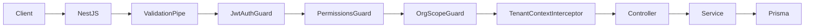
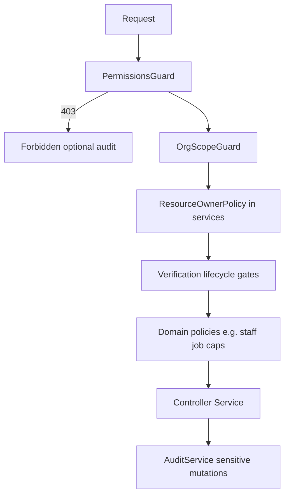
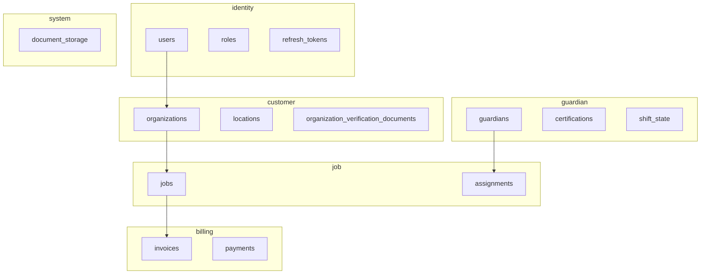

# Architecture

High-level design of the G2 Sentry Guardian API.

## Request pipeline

| Layer | Location | Role |
|-------|----------|------|
| Global prefix | [`src/main.ts`](../src/main.ts) | All routes under `/api/v1` (from `API_PREFIX`) |
| Validation | `ValidationPipe` | Whitelist DTO fields, transform types |
| Auth | [`JwtAuthGuard`](../src/auth/guards/jwt-auth.guard.ts) | Bearer JWT; `@Public()` skips |
| Permissions | [`PermissionsGuard`](../src/auth/guards/permissions.guard.ts) | `@RequirePermissions('jobs:create')` |
| Org scope | [`OrgScopeGuard`](../src/auth/guards/org-scope.guard.ts) | Route param org membership |
| Tenant context | [`TenantContextInterceptor`](../src/common/interceptors/tenant-context.interceptor.ts) | Sets DB session vars from `activeOrgId` for RLS-ready queries |
| API docs | Swagger at `/docs` | OpenAPI from decorators |

## Authorization

Handlers use **permission codes** (`resource:action`), not HTTP paths. The matrix is seeded in [`prisma/seed/permissions.ts`](../prisma/seed/permissions.ts) — that file is the source of truth.

| Layer | Question | Example |
|-------|----------|---------|
| Permission | Is this action allowed? | `jobs:create` |
| Scope | Whose row? | Org membership via [`ResourceOwnerPolicy`](../src/common/policies/resource-owner.policy.ts) |
| State | Lifecycle gate? | `ORG_PENDING_VERIFICATION` |
| Policy | Constraints when allowed? | Staff job caps (future) |

### Grant tables

| Table | Scope | Maps |
|-------|-------|------|
| `identity.role_permissions` | Platform | `Role` (`SUPER_ADMIN`, `OPS_ADMIN`, `GUARDIAN`) → permissions |
| `identity.org_member_role_permissions` | Organization (implicit) | `OrgMemberRole` (`CLIENT_OWNER`, `CLIENT_STAFF`) → permissions; effective when `activeOrgId` is set |

Effective permissions = platform role permissions ∪ org member role permissions for the active org.

Resolved per request by [`PermissionResolverService`](../src/auth/permission-resolver.service.ts), cached in Redis (`perms:{userId}:{activeRole}:{activeOrgId ?? 'platform'}`). Invalidate with `DEL perms:{userId}:*` on membership changes.

### Non-goals

| Item | Decision |
|------|----------|
| `UserPermission` (direct grants) | Not implemented — assign via roles / org member role |
| Permissions in JWT | Not implemented — resolver + cache only |
| HTTP paths as permissions | Not used — only `resource:action` codes |

## Application modules

Registered in [`src/app.module.ts`](../src/app.module.ts).

| Module | Responsibility | Controller prefix |
|--------|----------------|-------------------|
| `AuthModule` | Register, sign-in, tokens, OTP | `/auth` |
| `UsersModule` | Profile (`/users/me`) | `/users` |
| `OrganizationsModule` | Orgs, members, locations | `/organizations` |
| `JobsModule` | Job CRUD, dispatch, complete, incidents, client live tracking (`GET /jobs/:id/tracking`) | `/jobs` |
| `AssignmentsModule` | Guardian accept/decline offers | `/assignments` |
| `DispatchingModule` | Internal dispatch orchestration | (service; routes moved to jobs/assignments) |
| `GuardiansModule` | Shift, heartbeat, guardian profile | `/guardians` |
| `AdminModule` | Guardian onboarding, verification, pricing, audit | `/admin` |
| `BillingModule` | Invoices | `/invoices` |
| `PaymentsModule` | Payment initiation and confirm | `/payments` |
| `DocumentsModule` | Document upload and download (bytes in PostgreSQL) | `/documents` |
| `NotificationsModule` | User notifications | `/notifications` |
| `RegionsModule` | Region reference data | `/regions` |
| `WebhooksModule` | External webhooks | `/webhooks` |
| `CommonModule` | Audit, policies, shared services | — |
| `PrismaModule` | Database access | — |
| `RedisModule` | Cache, refresh token revocation | — |
| `QueueModule` / `OutboxModule` | Async jobs and outbox pattern | — |

## Data model (PostgreSQL schemas)

Prisma multi-schema layout in [`prisma/schema.prisma`](../prisma/schema.prisma):

| Schema | Main entities |
|--------|----------------|
| `identity` | Users, roles, refresh tokens |
| `customer` | Organizations, locations, org verification documents, org members |
| `guardian` | Guardians, certifications, vetting, shift state |
| `job` | Jobs, assignments, incidents, timeline |
| `billing` | Invoices, payments, pricing |
| `audit` | Audit log entries |
| `analytics` | Analytics aggregates |
| `system` | Document storage metadata |

## Authentication tokens

| Token | Issued by | Lifetime | Use |
|-------|-----------|----------|-----|
| **Access JWT** | `TokenService.issueTokens` | `JWT_EXPIRES_IN` (default 15m) | `Authorization: Bearer` on API calls |
| **Refresh JWT** | Same | `JWT_REFRESH_EXPIRES_IN` (default 7d) | `POST /auth/refresh`; stored in DB + Redis revocation |
| **Onboarding JWT** | `TokenService.issueOnboardingToken` | 7 days | Registration wizard; claims `purpose: onboarding`, optional `orgId` |
| **Setup JWT** | `issueSetupToken` | Short-lived | Password setup for users without `passwordSetAt` |

Access payload ([`AuthUserPayload`](../src/auth/interfaces/auth-user.interface.ts)): `sub`, `phone`, `roles`, `activeRole`, `activeOrgId`, `organizationIds`, optional `guardianId`. Permissions are **not** in the JWT; see `GET /users/me` or per-request resolver.

## Authorization policies

| Policy | File | Enforces |
|--------|------|----------|
| Organization verification | [`organization-verification.policy.ts`](../src/common/policies/organization-verification.policy.ts) | Job create/cancel/dispatch, payment create require org `VERIFIED` |
| Guardian eligibility | [`guardian-eligibility.service.ts`](../src/guardians/guardian-eligibility.service.ts) | Shift start and dispatch offers |
| Resource owner | [`resource-owner.policy.ts`](../src/common/policies/resource-owner.policy.ts) | Tenant-scoped reads/writes |

## Async and integrations

- **Redis:** OTP storage, refresh token revocation, guardian presence for dispatch and tracking ([`PresenceService`](../src/redis/presence.service.ts)).
- **BullMQ / queue:** Offer expiry, connectivity checks ([`QueueModule`](../src/queue/queue.module.ts)).
- **Outbox:** Dispatch retries via `JOB_DISPATCH_REQUESTED` ([`OutboxModule`](../src/outbox/outbox.module.ts), [`DispatchingService`](../src/dispatching/dispatching.service.ts)).
- **Documents:** Verification file bytes stored in PostgreSQL `system.document_storage.content` ([`DocumentsService`](../src/documents/documents.service.ts)); configure `DOCUMENT_MAX_BYTES`.

### Dispatch and client live tracking

| Concern | Implementation |
|---------|----------------|
| Offer flow | Sequential offers (`OFFERED`, 90s TTL); guardian `shift` + heartbeat required |
| Guardian GPS | `POST /guardians/me/heartbeat` → Redis + `location_history` |
| Client map/ETA | `GET /jobs/:id/tracking` — job-scoped; [`JobsService.getTracking`](../src/jobs/jobs.service.ts), [`geo.util`](../src/common/geo.util.ts) |

### Dispatch roadmap prerequisites

- Presence filtering currently checks reachability sequentially per guardian; before increasing candidate pool size or reducing offer TTL, switch to batched Redis reads (`MGET`/pipeline) in [`PresenceService`](../src/redis/presence.service.ts).
- Realtime rollout must keep `GET /assignments/me` as an explicit reconciliation contract after disconnect/reconnect so missed push events do not leave clients with stale offer state.

Mobile integration: [api/mobile-job-dispatch-and-tracking.md](api/mobile-job-dispatch-and-tracking.md).

## Related docs

- [user-journeys.md](user-journeys.md) — business flows
- [api/README.md](api/README.md) — HTTP surface
- [api/jobs.md](api/jobs.md) — jobs & tracking endpoints
- [api/mobile-job-dispatch-and-tracking.md](api/mobile-job-dispatch-and-tracking.md) — mobile dispatch & tracking
- [operations.md](operations.md) — deployment
