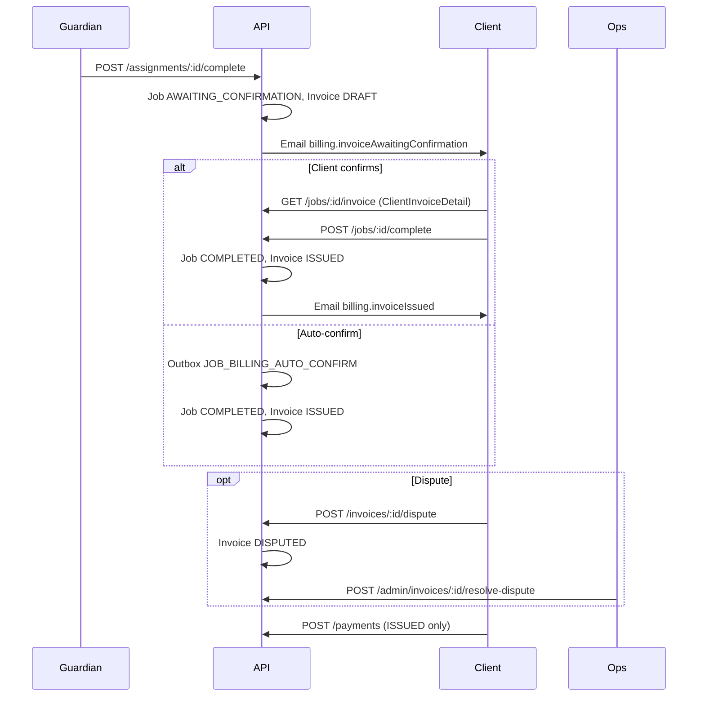

# Production billing overhaul — implementation guide

This document is the **single entry point** for the billing changes shipped in phases 1–6. It explains what changed, how to deploy, and how each app (client, guardian, admin) should integrate.

For field-level API detail, follow the linked domain guides under [`docs/api/`](api/README.md).

---

## Executive summary

| Problem (before) | Solution (after) |
|------------------|------------------|
| Guardian complete issued invoice immediately | Job → `AWAITING_CONFIRMATION`, invoice → `DRAFT`; client confirms or auto-confirm issues |
| Full scheduled window always billed | **Billing policies** compute billable hours from actual on-site time |
| Silent early leave | **Early release** request / approve / auto-approve workflow |
| No formal dispute path | Invoice **`DISPUTED`** status, client dispute + admin resolve |
| Ops blind to under-delivery | Scheduled **anomaly scan** + **reconciliation** report |
| Raw invoice JSON in clients | Stable **`ClientInvoiceDetail`** / **`ClientInvoiceSummary`** contract |

---

## Deploy checklist

Run on **every** environment (dev, staging, production) in this order:

```bash
# 1. Database migrations (three billing migrations)
npx prisma migrate deploy

# 2. Prisma client (local/CI builds)
npx prisma generate

# 3. Permissions (dispute, early-release, admin billing, etc.)
npm run db:seed
# equivalent: npm run db:seed:v1

# 4. Restart API (loads env + background scanners)
npm run build && npm run start:prod
# dev: npm run dev
```

### Migrations

| Migration | Purpose |
|-----------|---------|
| `20260603120000_billing_confirmation` | `BillingPolicy`, `JobStatus.AWAITING_CONFIRMATION`, invoice breakdown columns |
| `20260603140000_early_release_workflow` | `EARLY_RELEASE_REQUESTED`, early-release fields on assignments |
| `20260603160000_invoice_dispute_lifecycle` | `PENDING_CONFIRMATION`, `DISPUTED`, dispute/void metadata |

### Environment variables

Add to `.env` (see [`.env.example`](../.env.example)):

```env
# Phase 1 — hours until auto-issue if client does not confirm
BILLING_AUTO_CONFIRM_HOURS=24

# Phase 5 — ops anomaly scan thresholds (minutes / hours)
BILLING_OPS_EARLY_COMPLETION_MINUTES=30
BILLING_OPS_LATE_ARRIVAL_MINUTES=15
BILLING_OPS_SCAN_LOOKBACK_HOURS=24
```

SMTP variables (`SMTP_HOST`, etc.) control billing emails — see [api/email-notifications.md](api/email-notifications.md).

---

## End-to-end billing flow



---

## Phase 1 — Fair billing + confirmation gate

### Behavior

- **Billable hours** (default policy `MINIMUM_GUARANTEED`):
  ```
  billableHours = max(minimumHours, min(scheduledHours, actualHours))
  ```
  `actualHours` = `completedAt - arrivedAt` on the assignment.
- **Guardian** `POST /assignments/:id/complete` → job **`AWAITING_CONFIRMATION`**, invoice **`DRAFT`** (not issued).
- **Client** `POST /jobs/:id/complete` → job **`COMPLETED`**, invoice **`ISSUED`**.
- **Auto-confirm** after `BILLING_AUTO_CONFIRM_HOURS` (default 24) via outbox worker.

### Client implementation

1. Handle job status **`AWAITING_CONFIRMATION`** after guardian complete (not `COMPLETED`).
2. Show billing review UI using `GET /jobs/:id/invoice`.
3. Call `POST /jobs/:id/complete` to approve and issue.
4. Enable payment only when invoice status is **`ISSUED`** (or `PARTIALLY_PAID`).

### Key backend modules

| Module | Role |
|--------|------|
| `BillingCalculationService` | Policy resolution + hours formula |
| `BillingService` | Draft create, `issueIfDraft` |
| `BillingConfirmationService` | Auto-confirm handler |
| `AssignmentsService.complete` | Triggers draft invoice, not issue |

**Docs:** [api/jobs.md](api/jobs.md), [api/changelog.md](api/changelog.md) (Billing confirmation)

---

## Phase 2 — Admin billing policies

Ops configure **how hours are calculated** without code changes.

| Method | Path | Permission |
|--------|------|------------|
| GET | `/admin/billing-policies` | `admin:billing:read` |
| POST | `/admin/billing-policies` | `admin:billing:write` |
| PATCH | `/admin/billing-policies/:id` | `admin:billing:write` |

Models include `MINIMUM_GUARANTEED`, `BOOKED_BLOCK`, `ACTUAL_TIME`, plus early-release settings (`allowEarlyRelease`, `prorationEnabled`, `autoApproveAfterMinutes`, …).

**Pricing** (rates) remains in [api/admin-pricing.md](api/admin-pricing.md).

**Docs:** [api/admin-billing-policies.md](api/admin-billing-policies.md)

---

## Phase 3 — Early release workflow

| Action | Endpoint | Permission |
|--------|----------|------------|
| Request | `POST /assignments/:id/early-release` | `assignments:early_release` |
| Approve | `POST /assignments/:id/early-release/approve` | `assignments:early_release_approve` |
| Reject | `POST /assignments/:id/early-release/reject` | `assignments:early_release_reject` |
| Complete | `POST /assignments/:id/complete` | From `ON_SITE` or approved `EARLY_RELEASE_REQUESTED` |

Assignment status **`EARLY_RELEASE_REQUESTED`** added. Auto-approve runs on a 60s interval when policy `autoApproveAfterMinutes` elapses.

**Billing:** `BOOKED_BLOCK` + approved early release + `prorationEnabled` → bill **actual** hours.

**Docs:** [api/early-release.md](api/early-release.md)

---

## Phase 4 — Invoice dispute lifecycle

### Invoice statuses (billing)

| Status | Meaning |
|--------|---------|
| `DRAFT` | Created on guardian complete |
| `PENDING_CONFIRMATION` | Client opened `GET /invoices/:id` |
| `ISSUED` | Confirmed or auto-confirmed |
| `DISPUTED` | Client disputed; issue & payment blocked |
| `VOID` | Voided (`voidReason` required) |
| `PAID` / `PARTIALLY_PAID` / `OVERDUE` | Payment lifecycle |

### Endpoints

| Method | Path | Permission |
|--------|------|------------|
| GET | `/invoices/:id` | `billing:read` |
| POST | `/invoices/:id/dispute` | `billing:dispute` |
| POST | `/invoices/:id/void` | `billing:void` |
| POST | `/admin/invoices/:id/resolve-dispute` | `admin:invoices:resolve_dispute` |

Resolve body: `{ "action": "CLEAR" \| "VOID", "note?", "voidReason?", "replacementInvoiceId?" }`.

**Docs:** [api/invoice-disputes.md](api/invoice-disputes.md)

---

## Phase 5 — Ops observability

### Background scan (every 60s, skipped in `NODE_ENV=test`)

| Alert | Condition | Audit `action` |
|-------|-----------|----------------|
| Early completion | `completedAt` > `BILLING_OPS_EARLY_COMPLETION_MINUTES` before `scheduledEnd` | `BILLING_ALERT_EARLY_COMPLETION` |
| Late arrival | `arrivedAt` > `BILLING_OPS_LATE_ARRIVAL_MINUTES` after `scheduledStart` | `BILLING_ALERT_LATE_ARRIVAL` |

Audit filter: `GET /admin/audit-logs?entityType=billing.ops_alert`.

### Reconciliation report

```
GET /admin/billing/reconciliation?from=<ISO>&to=<ISO>&organizationId=&guardianId=
```

Permission: `admin:billing:read`. Response includes `items`, `summary`, `meta.lowSampleSize` (true when &lt; 20 rows).

**Docs:** [api/admin-billing-ops.md](api/admin-billing-ops.md)

---

## Phase 6 — Client invoice JSON contract (breaking)

Detail endpoints return **`ClientInvoiceDetail`**, not raw DB rows.

| Endpoint | Response type |
|----------|---------------|
| `GET /jobs/:id/invoice` | `ClientInvoiceDetail` |
| `GET /invoices/:id` | `ClientInvoiceDetail` |
| `GET /organizations/:id/invoices` | `ClientInvoiceSummary[]` |

### Shape (detail)

```json
{
  "id": "uuid",
  "jobId": "uuid",
  "job": { "referenceNumber": "JOB-…", "status": "AWAITING_CONFIRMATION" },
  "status": "PENDING_CONFIRMATION",
  "currency": "RWF",
  "scheduledWindow": { "startAt": "…", "endAt": "…", "hours": "8" },
  "actual": { "arrivedAt": "…", "completedAt": "…", "hours": "2.9167" },
  "billing": { "basis": "MINIMUM_GUARANTEED", "policyModel": "…", "billableHours": "3" },
  "amounts": { "subtotal": "15000", "tax": "2700", "total": "17700" },
  "lineItems": [{ "code": "billable_hours", "label": "…", "quantity": "3.00 hrs" }],
  "payments": [],
  "dispute": null,
  "void": null,
  "issuedAt": null,
  "dueAt": null,
  "createdAt": "…"
}
```

**Breaking change:** use `amounts.total` and `billing.billableHours` — not top-level `subtotal` / `billableHours`.

Swagger: `ClientInvoiceDetailDto` at `/docs`.

**Docs:** [api/invoice-detail.md](api/invoice-detail.md)

---

## Permissions (after `npm run db:seed`)

| Permission | Typical role |
|------------|----------------|
| `jobs:complete` | Client owner |
| `jobs:read_invoice` | Client staff+ |
| `billing:read` | Client staff+ |
| `billing:dispute` | Client owner, ops |
| `billing:issue`, `billing:void` | Ops |
| `assignments:early_release` | Guardian |
| `assignments:early_release_approve`, `assignments:early_release_reject` | Client owner, ops |
| `admin:billing:read`, `admin:billing:write` | Ops |
| `admin:invoices:resolve_dispute` | Ops |
| `admin:invoices:read` | Ops |

---

## Email templates

| Template | Trigger |
|----------|---------|
| `billing.invoiceAwaitingConfirmation` | DRAFT invoice created |
| `billing.invoiceIssued` | Invoice issued |
| `assignment.earlyReleaseRequested` | Guardian early-release request |
| `billing.invoiceDisputed` | Client dispute |
| `billing.invoiceDisputeResolved` | Admin clears dispute |
| `billing.invoiceVoided` | Void (includes reason) |
| `billing.paymentConfirmed` | Payment confirmed |

Full matrix: [api/email-notifications.md](api/email-notifications.md).

---

## Suggested rollout order

1. Deploy API — migrations, seed, env, restart.
2. Ops — configure [billing policies](api/admin-billing-policies.md) and [pricing rules](api/admin-pricing.md).
3. Client apps — `AWAITING_CONFIRMATION`, `ClientInvoiceDetail`, confirm/dispute/pay flows.
4. Guardian app — early release (if policies allow).
5. Admin — reconciliation UI, audit alerts, dispute resolution.
6. Smoke test — guardian complete → client review → confirm → pay; optional dispute path.

---

## Related documentation index

| Topic | File |
|-------|------|
| API overview | [api/README.md](api/README.md) |
| Changelog / breaking changes | [api/changelog.md](api/changelog.md) |
| Client screen → API map | [api/client-integration.md](api/client-integration.md) |
| Job statuses & routes | [api/jobs.md](api/jobs.md) |
| Invoice JSON contract | [api/invoice-detail.md](api/invoice-detail.md) |
| Disputes | [api/invoice-disputes.md](api/invoice-disputes.md) |
| Early release | [api/early-release.md](api/early-release.md) |
| Admin billing policies | [api/admin-billing-policies.md](api/admin-billing-policies.md) |
| Ops / reconciliation | [api/admin-billing-ops.md](api/admin-billing-ops.md) |
| Pricing rules | [api/admin-pricing.md](api/admin-pricing.md) |
| Operations / deploy | [operations.md](operations.md) |
