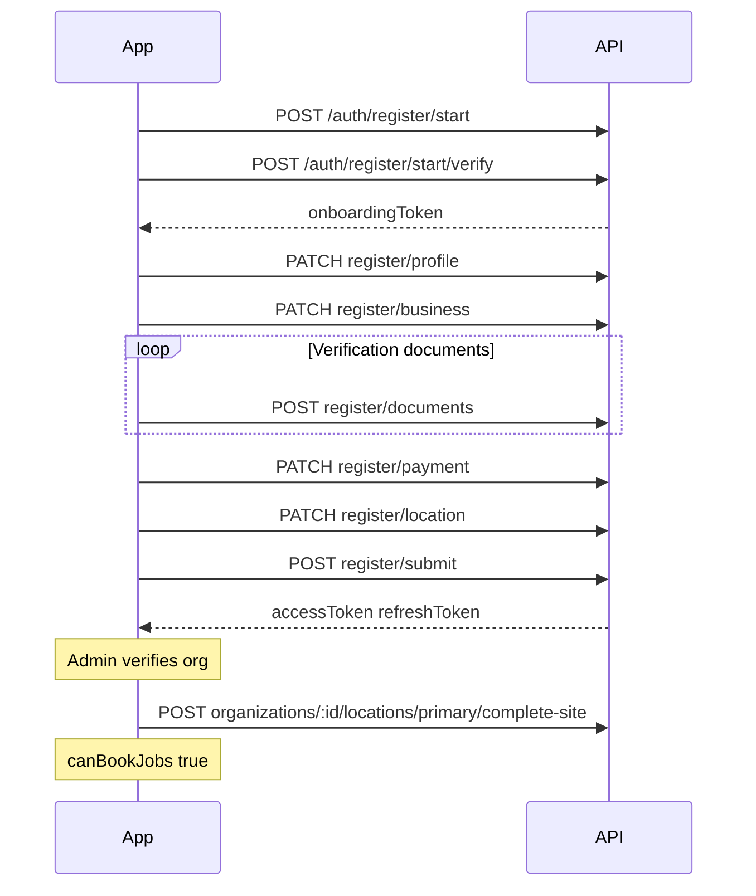
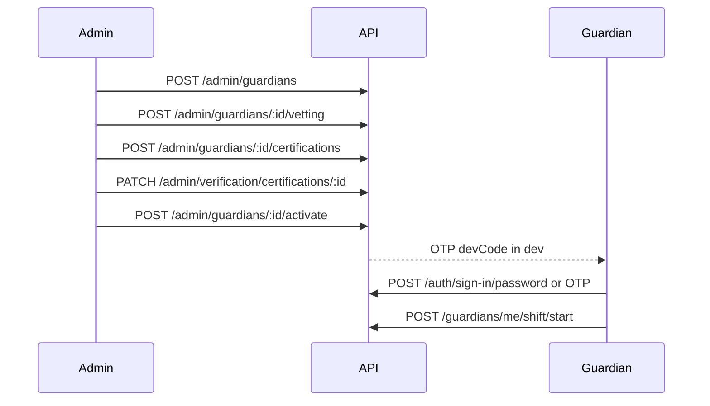
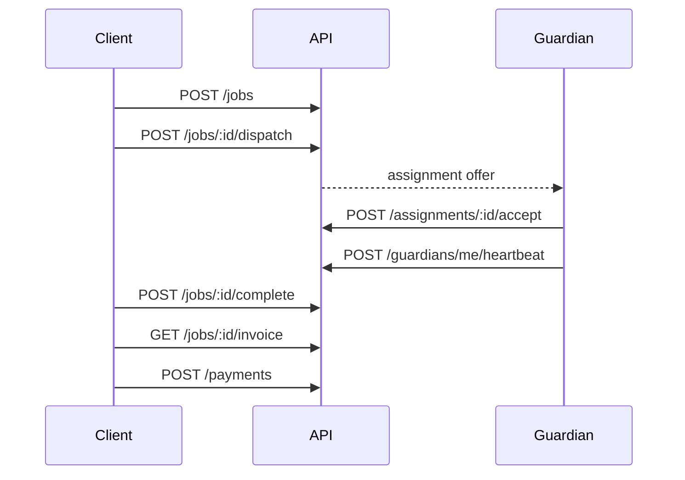

# User journeys

End-to-end flows for clients, guardians, and administrators. Request/response shapes are in **Swagger** (`/docs`); this document describes **sequence and business rules**.

**Building client or guardian apps?** Use the screen → endpoint map in [api/client-integration.md](api/client-integration.md).

## Roles

| Role | How they join | Primary actions |
|------|---------------|-----------------|
| **Client owner / staff** | Self-register (application + OTP) | Book jobs, manage org locations, pay |
| **Guardian** | Admin creates after RNP vetting | Accept assignments, shift on/off, heartbeat |
| **Ops / super admin** | Manual DB or extended seed | Verify orgs/guardians, onboard guardians, dispatch oversight |

Guardians **cannot** use client registration routes (`/auth/register/*`).

---

## 1. Client registration

Phone OTP first; progressive steps; submit before sign-in. Full API: [api/onboarding.md](api/onboarding.md).

### Registration steps

1. **Phone** — `POST /auth/register/start` → `start/verify` → `onboardingToken` (7 days).
2. **Profile** — name, email, password.
3. **Business** — legal name, `orgType`, optional TIN (required at submit).
4. **Documents** — types depend on `orgType` (`INDIVIDUAL` vs business).
5. **Payment** — mobile money.
6. **Location** — address + district only (server sets district centroid coordinates).
7. **Submit** — validates TIN + docs; user `ACTIVE`; org `PENDING`.

### After submit — until admin approval

| Allowed | Blocked |
|---------|---------|
| Sign in, read profile/org | `POST /jobs`, `POST /payments` |

`canBookJobs: false` — `ORG_PENDING_VERIFICATION` on job/payment create.

### After admin approval — complete your site

Admin `PATCH /admin/verification/organizations/:id` → `VERIFIED`.

Client must **`POST /organizations/:id/locations/primary/complete-site`** with map pin (lat/lon).

Then `canBookJobs: true` on `GET /users/me`.

Details: [api/onboarding.md](api/onboarding.md), [api/admin.md](api/admin.md).

---

## 2. Client sign-in and session

| Action | Endpoint |
|--------|----------|
| Primary login | `POST /auth/sign-in/password` |
| OTP login (existing users) | `POST /auth/sign-in/otp/request` → `.../verify` |
| Forgot password | `POST /auth/password/reset/request` → `.../confirm` |
| Refresh | `POST /auth/refresh` |
| Logout | `POST /auth/logout` |
| Switch organization | `POST /auth/context` |

Sign-in before step 2 OTP completes may return `PHONE_NOT_VERIFIED`.

Access token carries `activeOrgId`, `organizationIds`, roles. Use `POST /auth/context` when the user belongs to multiple organizations.

---

## 3. Guardian onboarding (admin only)

1. **Create** — `POST /admin/guardians` (profile, districts, national ID hash, etc.)
2. **Vetting** — `POST /admin/guardians/:id/vetting` (RNP record)
3. **Certifications** — `POST /admin/guardians/:id/certifications`
4. **Verify cert** — `PATCH /admin/verification/certifications/:id` → `VERIFIED`
5. **Verify guardian** — `PATCH /admin/verification/guardians/:id` → `VERIFIED`
6. **Activate** — `POST /admin/guardians/:id/activate` (sends OTP; guardian sets password if needed)
7. **Go available (on duty)** — `POST /guardians/me/shift/start` (eligibility checks apply) — see [api/guardians.md](api/guardians.md)

Suspend: `POST /admin/guardians/:id/suspend`.

Request bodies, initial DB state, and enums: [api/admin-onboarding.md](api/admin-onboarding.md). Route index: [api/admin.md](api/admin.md).

### Dispatch eligibility

Duty labels and endpoints: [api/guardians.md](api/guardians.md).

A guardian is offered jobs only when:

- `status = ACTIVE`
- `verification_status = VERIFIED`
- **Available** on duty (`shift_status = AVAILABLE`, `available_for_jobs = true`)
- Job district matches `district_base` or `coverage_districts`
- At least one certification: `VERIFIED` and not past `expiry_date`

---

## 4. Job lifecycle

| Stage | Who | Endpoint |
|-------|-----|----------|
| Create job | Client (verified org) | `POST /jobs` |
| List / detail | Client, guardian, admin | `GET /jobs`, `GET /jobs/:id` |
| Dispatch | Client or admin | `POST /jobs/:id/dispatch` |
| Accept / decline offer | Guardian | `POST /assignments/:id/accept`, `.../decline` |
| Cancel | Client owner / admin | `PATCH /jobs/:id/cancel` |
| Complete | Client owner / admin | `POST /jobs/:id/complete` |
| Invoice | Client | `GET /jobs/:id/invoice` |
| Pay | Client (verified org) | `POST /payments` |

Guardian duty and location: see [api/guardians.md](api/guardians.md) — `POST /guardians/me/shift/start` (available), `.../shift/end` (offline), `POST /guardians/me/heartbeat` (connectivity only).

Legacy route names: [api/changelog.md](api/changelog.md).

---

## 5. Error codes (journey-related)

| Code | Journey |
|------|---------|
| `PHONE_ALREADY_REGISTERED` | Client register step 1 |
| `DOCUMENTS_REQUIRED` | `POST /auth/register/submit` without acceptable docs |
| `ONBOARDING_TOKEN_INVALID` | Expired or invalid onboarding JWT |
| `ORG_PENDING_VERIFICATION` | Job/payment before org verified |
| `GUARDIAN_NOT_ACTIVATED` | Guardian not yet activated |
| `USER_NOT_REGISTERED` | Sign-in for unknown phone |

Registration errors: [api/onboarding.md](api/onboarding.md). Sign-in and tokens: [api/auth.md](api/auth.md).
